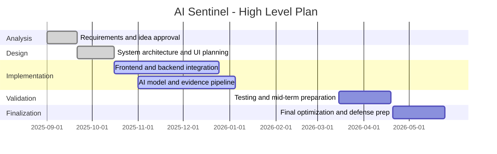
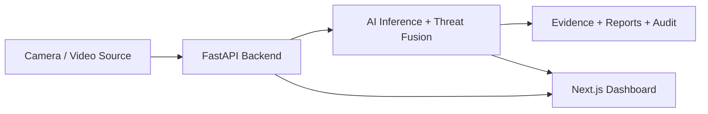

# AI Sentinel
## ملف الميد - Phase 2 - المسار التطبيقي

**Official Project Title:** Deep Learning-Based Real-Time Physical Violence Detection for Intelligent Surveillance  
**System / Product Name:** AI Sentinel  
**Course:** Graduation Project Phase 2 (`CNET 575`)  
**Track:** Applied / Practical Project  
**University:** Jazan University  
**Department:** Electrical and Electronic Engineering / Computer & Networks Track  
**Academic Year:** 2025-2026  
**Prepared For:** Mid-Term Examination - Phase 2  
**Group No.:** G-9  
**Team:** Marwan Masri, Abdulaziz Alhazmi, Saleh Hardi, Mohannad Moafa, Wael Alfaifi  
**Student IDs:** 202209160, 202201267, 202202478, 202200292, 202203821  
**Supervisor:** Dr. Abdoh Jabbari  
**Domain Expert:** غير مذكور بوضوح في ملف `Phase 1` المرفق

---

## حقوق الملكية الفكرية

Copyright © 2026 AI Sentinel Team - Group G-9. All Rights Reserved.

هذا المستند وكامل الفكرة المعمارية، الأكواد، الواجهات، التقارير، المخططات، وآلية الربط بين الكاميرات ومحرك الذكاء الاصطناعي هي ملك حصري لفريق مشروع **AI Sentinel / Group G-9**:

- Marwan Masri
- Abdulaziz Alhazmi
- Saleh Hardi
- Mohannad Moafa
- Wael Alfaifi

لا يسمح بإعادة النسخ أو النشر أو إعادة الاستخدام الكلي أو الجزئي دون إذن خطي من الفريق والمشرف الأكاديمي.

---

## الملخص التنفيذي

المشروع الرسمي المسجل بعنوان **Deep Learning-Based Real-Time Physical Violence Detection for Intelligent Surveillance**، بينما الاسم التشغيلي للنظام المطور داخل المشروع هو **AI Sentinel**.  
`AI Sentinel` هو نظام مراقبة ذكي يعمل في الزمن الحقيقي لاكتشاف أحداث العنف والمخاطر الأمنية من بث الكاميرات، ثم إصدار تنبيهات فورية مع حفظ الأدلة الرقمية وإنشاء تقارير جنائية آلية باللغة العربية. يعتمد المشروع على واجهة تشغيل تفاعلية مبنية بـ `Next.js` ومحرك خلفي مبني بـ `FastAPI` ونموذج رؤية حاسوبية يعتمد على `X3D` مع نافذة تحليل زمنية من `32 frame`، إضافة إلى طبقة دمج مخاطر تشمل العنف، الحركة، واكتشاف الأسلحة.

المشروع مناسب للمسار التطبيقي لأنه لا يقتصر على الجانب النظري، بل يقدم:

- نظامًا فعليًا قابلًا للتشغيل على حاسب عادي.
- ربطًا مباشرًا أو شبه مباشر مع كاميرا مراقبة.
- واجهة تشغيل وعرض حي للتنبيهات.
- حفظ الأدلة `Evidence Clips`, `Snapshots`, `Reports`.
- قابلية توسع لاحقة للربط مع كاميرات `RTSP/ONVIF`.

بالنسبة لتجهيز العرض العملي، يمكن استخدام:

- **حاسب عادي** لتشغيل الواجهة الأمامية والخلفية.
- **كاميرا Anker 2K** كمصدر فيديو إذا أمكن الوصول إليها عبر `USB/UVC` أو `RTSP`.
- وفي حال عدم دعم الكاميرا للبث المباشر القياسي، فالنظام يدعم حاليًا مصادر فيديو اختبارية جاهزة تم إعدادها داخل المشروع لإتمام الديمو بثبات.

---

## الكلمات المفتاحية

الذكاء الاصطناعي، المراقبة الذكية، كشف العنف، كشف الأسلحة، التحليل الجنائي، الأدلة الرقمية، الأمن، البث الحي، `FastAPI`, `Next.js`, `Computer Vision`

---

## 1. مقدمة المشروع

تواجه البيئات الجامعية، المنشآت الإدارية، والمواقع العامة تحديًا مهمًا في مراقبة الأحداث الخطرة في الوقت المناسب. أنظمة المراقبة التقليدية تعتمد غالبًا على المشاهدة البشرية المستمرة، مما يسبب تأخرًا في الاستجابة، وتفاوتًا في جودة المراقبة، وصعوبة في توثيق الأدلة بطريقة منهجية.

جاء مشروع `AI Sentinel` لمعالجة هذه المشكلة من خلال نظام ذكي قادر على:

- مراقبة بث الكاميرات بصورة مستمرة.
- تحليل المشهد آليًا لاكتشاف سلوك عنيف أو تهديد محتمل.
- إصدار تنبيه لحظي.
- توثيق الحدث بصريًا ونصيًا.
- عرض الحدث داخل لوحة تحكم موحدة.

---

## 2. خلفية المشكلة

الاعتماد الكامل على العنصر البشري في أنظمة المراقبة يسبب عدة مشاكل:

- احتمالية عدم ملاحظة الحدث مباشرة بسبب الضغط أو تعدد الشاشات.
- صعوبة الرجوع إلى الأدلة بسرعة عند وقوع حادث.
- عدم وجود وصف جنائي منظم للحادثة.
- تأخر اتخاذ القرار الأمني.
- غياب آلية موحدة لربط الكاميرات والتنبيه والتوثيق في منصة واحدة.

المشروع يعالج هذه الفجوة من خلال دمج الرؤية الحاسوبية مع واجهة مراقبة تشغيلية.

---

## 3. الحل المقترح

الحل هو منصة ذكية متكاملة تستقبل البث من الكاميرات أو ملفات الفيديو، ثم تمرر الإطارات إلى محرك تحليل ذكي يقوم بما يلي:

1. تحليل تسلسل الإطارات لاكتشاف العنف.
2. احتساب درجة الحركة.
3. البحث عن إشارات لوجود سلاح.
4. دمج هذه الإشارات في درجة تهديد موحدة.
5. إنشاء تنبيه مرئي داخل لوحة التحكم.
6. حفظ مقطع دليل قبل وبعد الحادث.
7. التقاط صورة مرجعية.
8. إنشاء تقرير جنائي آلي باللغة العربية.

---

## 4. أهداف المشروع

### 4.1 الهدف العام

تطوير نظام مراقبة ذكي يعمل في الزمن الحقيقي لاكتشاف العنف والتهديدات الأمنية وتحويلها إلى إنذار وتشغيل وتوثيق رقمي قابل للاستخدام العملي.

### 4.2 الأهداف التفصيلية

- بناء واجهة مراقبة تفاعلية لعرض الفيديو والتنبيهات.
- تطوير محرك خلفي لتحليل الفيديو في الزمن الحقيقي.
- دمج نموذج ذكاء اصطناعي لاكتشاف العنف.
- دعم كشف الأسلحة كعامل رفع للخطورة.
- توليد تقرير حادث احترافي باللغة العربية.
- حفظ الأدلة الرقمية بطريقة منظمة.
- تجهيز المشروع ليعمل على حاسب عادي مع كاميرا أو مصادر فيديو حقيقية.
- تقديم مشروع قابل للتوسع لاحقًا للربط مع أنظمة أمنية أكبر.

---

## 5. نطاق المشروع

### يشمله المشروع

- مراقبة فيديو حي أو شبه حي.
- اكتشاف العنف في المشهد.
- إصدار تنبيه لحظي.
- عرض الأحداث في واجهة تشغيل.
- حفظ مقاطع الأدلة والصور المصاحبة.
- إعداد تقرير حادث.
- إدارة مصادر الكاميرات.
- دعم الخصوصية على مستوى معلومات التعرف الوجهي.

### لا يشمله المشروع في نسخة الميد

- الربط المؤسسي الكامل مع أنظمة أمن الجامعة.
- نشر سحابي واسع النطاق.
- نظام صلاحيات مستخدمين متعددين مكتمل.
- تكامل إنتاجي نهائي مع جميع أنواع الكاميرات التجارية المغلقة.

---

## 6. الأعمال السابقة والمراجعة المختصرة

تعتمد الأنظمة التقليدية عادة على أحد اتجاهين:

- أنظمة تسجيل ومشاهدة فقط دون تحليل ذكي.
- نماذج بحثية تكشف حدثًا محددًا لكن بدون واجهة تشغيل وأدلة وتقارير.

تميّز `AI Sentinel` عن الحلول العامة يتمثل في دمج أربع طبقات في منتج واحد:

- **Video Intelligence** لاكتشاف العنف.
- **Threat Fusion** لدمج عدة مؤشرات خطورة.
- **Forensic Reporting** لإنشاء تقرير حادث آلي بالعربية.
- **Evidence Integrity** لحفظ الأدلة مع بصمة `SHA-256` وسجل مترابط.

هذا الدمج يمنح المشروع قيمة تطبيقية أعلى من مجرد نموذج تصنيف فيديو معزول.

---

## 7. دراسة الجدوى

## 7.1 الغرض من دراسة الجدوى

التأكد من أن المشروع قابل للتنفيذ داخل بيئة أكاديمية بموارد محدودة، ويمكن عرضه وتشغيله فعليًا خلال الميد والفترة النهائية.

## 7.2 مبررات اختيار النظام

- المشكلة واقعية وتمس الأمن والسلامة.
- المشروع يجمع بين الذكاء الاصطناعي، تطوير الويب، والرؤية الحاسوبية.
- قابل للعرض المباشر عمليًا.
- يحقق قيمة أكاديمية وتطبيقية واضحة.

## 7.3 الجدوى الاقتصادية

يمكن تشغيل المشروع بتكلفة أولية منخفضة نسبيًا:

- حاسب عادي لتشغيل الواجهة والخلفية.
- كاميرا متاحة لديكم حاليًا مثل `Anker 2K`.
- لا حاجة في نسخة الميد إلى خوادم إنتاجية عالية الكلفة.
- المشروع يستفيد من أدوات ومكتبات مفتوحة المصدر.

## 7.4 الجدوى التقنية

المشروع قابل للتنفيذ تقنيًا لأنه يعتمد على تقنيات متوفرة ومستخدمة فعليًا داخل المستودع:

- `Next.js` للواجهة.
- `FastAPI` للخلفية.
- `PyTorch` و`OpenCV` للتحليل المرئي.
- ملفات إعدادات قابلة للتعديل.
- دعم لمصادر كاميرات متعددة.

## 7.5 الجدوى التشغيلية

النظام مناسب للتشغيل في بيئات مثل:

- مداخل المباني.
- الممرات.
- المعامل.
- مناطق الاستقبال.

كما أن آلية العمل واضحة: كاميرا -> تحليل -> تنبيه -> حفظ دليل -> تقرير.

## 7.6 الوظائف المطلوبة من النظام

- استلام البث من مصدر فيديو.
- معالجة الفيديو تلقائيًا.
- إظهار التنبيهات للمستخدم.
- حفظ لقطات وأدلة.
- توفير حالة النظام وكاميراته.

---

## 8. خطة المشروع

## 8.1 Work Breakdown Structure

1. تحليل المشكلة والمتطلبات.
2. تصميم معمارية النظام.
3. إعداد الواجهة الأمامية.
4. إعداد الخادم الخلفي.
5. دمج نموذج كشف العنف.
6. إضافة طبقة كشف الأسلحة والدمج.
7. بناء نظام التقارير والأدلة.
8. ربط مصادر الكاميرات.
9. الاختبار والتحقق.
10. إعداد العرض والتوثيق.

## 8.2 قائمة الأنشطة والمهام

| النشاط | المخرجات |
|---|---|
| تحليل المتطلبات | تحديد أهداف ونطاق المشروع |
| تصميم النظام | مخطط معماري وتدفق البيانات |
| بناء الواجهة | Dashboard تفاعلي |
| بناء الخلفية | API, Streaming, Alerts |
| الذكاء الاصطناعي | كشف العنف + دمج الإشارات |
| التوثيق | تقارير وأدلة رقمية |
| الاختبار | حالات اختبار ونتائج |
| التحضير للميد | سيناريو عرض وإجابات دفاع |

## 8.3 تصور زمني مختصر

---

## 9. مواصفات المتطلبات - SRS

## 9.1 تحليل المتطلبات الوظيفية

يجب أن يكون النظام قادرًا على:

- استقبال مصدر فيديو حي أو ملف فيديو.
- عرض الفيديو داخل الواجهة.
- اكتشاف الأحداث الخطرة.
- إرسال التنبيهات إلى الواجهة في الزمن الحقيقي.
- حفظ دليل مرئي للحدث.
- إنشاء تقرير يمكن تحميله.
- تبديل الكاميرات أو مصادر الفيديو.
- عرض حالة النظام والخدمات.

## 9.2 المتطلبات غير الوظيفية

- سرعة استجابة مناسبة للعرض.
- تنظيم واضح للواجهة.
- قابلية الصيانة والتوسع.
- دعم التشغيل على جهاز عادي.
- دقة معقولة في التمييز بين الحالات الطبيعية والخطرة.
- حفظ الأدلة بطريقة منظمة وموثوقة.

## 9.3 متطلبات العتاد

### متطلبات الحد الأدنى لنسخة الميد

- حاسب عادي أو لابتوب.
- كاميرا واحدة على الأقل أو فيديوهات اختبارية.
- اتصال محلي بين مكونات النظام.

### العتاد المتوفر للفريق

- **كاميرا Anker 2K** متاحة للتجربة.
- **حاسب عادي** لتشغيل النظام.

### ملاحظة فنية مهمة بخصوص كاميرا Anker 2K

إذا كانت الكاميرا تدعم `USB/UVC` أو `RTSP/ONVIF` فسيتم استخدامها مباشرة كمصدر بث.  
أما إذا كانت تعمل فقط عبر تطبيق مغلق ولا تتيح بثًا قياسيًا، فسيتم تنفيذ الديمو باستخدام مصادر الفيديو الاختبارية الجاهزة داخل المشروع مع إبقاء الكاميرا كجزء من سيناريو التطبيق العملي المستهدف. هذا طرح مهني ومقبول أكاديميًا لأنه يوضح القيود الواقعية للتكامل التجاري.

## 9.4 متطلبات البرمجيات

- `Node.js` و`npm`
- `Next.js`
- `Python`
- `FastAPI`
- `PyTorch`
- `OpenCV`
- `YAML` configuration

---

## 10. تصميم النظام

## 10.1 التصميم المعماري

## 10.2 وصف المكونات

### الواجهة الأمامية

الواجهة مبنية باستخدام `Next.js` وتعرض:

- الفيديو الحي.
- سجل التنبيهات.
- لوحة تفاصيل الحادث.
- تقرير الذكاء الاصطناعي.
- حالة الاتصال والسياسات الأمنية.

### الخادم الخلفي

الخادم مبني باستخدام `FastAPI` ويوفر:

- بث فيديو `MJPEG`.
- تنبيهات لحظية `SSE`.
- تنزيل التقارير.
- تنزيل الأدلة.
- تبديل الكاميرات.
- واجهات حالة النظام والأمن.

### محرك الذكاء الاصطناعي

المشروع يحتوي على:

- نموذج كشف عنف يعتمد على `X3D` أو بديل مدعوم.
- نافذة تحليل زمنية بحجم `32 frame`.
- طبقة `Threat Fusion`.
- محرك كشف أسلحة.

### طبقة الأدلة والتوثيق

تتضمن:

- `evidence_clips`
- `thumbnails`
- `reports`
- `audit_logs.jsonl`
- `evidence_ledger.jsonl`

## 10.3 تدفق البيانات

1. يصل الفيديو من الكاميرا أو الملف.
2. يقرأه الخادم الخلفي.
3. تمر الإطارات إلى نموذج التحليل.
4. تُحسب درجة الخطورة.
5. عند تجاوز العتبة، ينشأ تنبيه.
6. يحفظ مقطع الدليل والصورة والتقرير.
7. يظهر الحدث مباشرة في لوحة التحكم.

## 10.4 ملاحظة بخصوص قاعدة البيانات

المشروع في مرحلته الحالية يستخدم حفظًا منظمًا للأدلة والسجلات بصيغة ملفات وهيكلية `append-only` مناسبة للجانب الجنائي، مع وجود إعداد `database.path: ./sentinel.db` لتهيئة توسعة لاحقة نحو قاعدة بيانات علائقية إذا طُلب ذلك في النسخة النهائية.  
هذا التبرير مهم في المناقشة لأنه يوضح أن اختيار التخزين الحالي كان قرارًا هندسيًا مرتبطًا بسلامة الأدلة وسهولة التتبع وليس نقصًا في التصميم.

---

## 11. التنفيذ الحالي في المشروع

بناءً على الملفات الموجودة فعليًا في المشروع، تم تنفيذ العناصر التالية:

- واجهة رئيسية في `app/page.tsx`.
- مكونات عرض مثل:
  - `components/video-player.tsx`
  - `components/alert-feed.tsx`
  - `components/incident-panel.tsx`
  - `components/ai-report.tsx`
- خادم خلفي متكامل في `backend/api.py`.
- محرك استدلال في `backend/inference.py`.
- كشف أسلحة في `backend/weapon.py`.
- سجل أدلة مترابط في `backend/evidence.py`.
- إنشاء تقرير PDF عربي في `backend/reporting.py`.
- ملفات ضبط للكاميرات في `backend/camera_profiles.yml`.

## 11.1 أهم الوظائف المنفذة

- بث فيديو حي إلى الواجهة.
- استقبال التنبيهات عبر `Server-Sent Events`.
- تنزيل التقرير الجنائي.
- تنزيل مقطع الدليل.
- تبديل الكاميرات.
- فحص حالة النظام.
- إدارة سياسة إظهار الهوية في طبقة التعرف الوجهي.

## 11.2 حالة اختبار برمجية موثقة

تم تشغيل اختبارات الوحدة الموجودة داخل المشروع بنجاح:

- عدد الاختبارات المنفذة: `8`
- النتيجة: `OK`

وهذا يعزز موقفكم في الميد عند الحديث عن وجود تحقق برمجي فعلي وليس مجرد كتابة كود.

---

## 12. الاختبارات والتحقق

## 12.1 حالات الاختبار المقترحة للديمو

| الحالة | المدخل | المتوقع |
|---|---|---|
| تشغيل النظام | تشغيل الواجهة والخلفية | ظهور الفيديو والواجهة دون أخطاء |
| حدث طبيعي | فيديو بدون عنف | لا يظهر تنبيه خطر |
| حدث عنيف | فيديو يحوي اشتباكًا | يظهر تنبيه مع درجة خطورة |
| وجود أداة خطرة | إطار يحمل جسمًا مشابهًا للسلاح | ترتفع درجة التهديد |
| إنشاء دليل | عند وقوع حدث | حفظ `clip + snapshot + report` |
| تنزيل التقرير | اختيار حدث | تحميل PDF |
| تبديل الكاميرا | اختيار مصدر آخر | انتقال العرض للمصدر المحدد |

## 12.2 آلية التحقق من النموذج المقترح

يتم التحقق من صحة النظام عبر:

- مقارنة سلوك النظام في مشاهد طبيعية ومشاهد خطرة.
- التأكد من ظهور التنبيه فقط عند الحالات ذات المؤشرات القوية.
- مراجعة الأدلة الناتجة لكل حادثة.
- قياس منطقية التقرير النصي الناتج.

---

## 13. مطابقة المشروع مع نموذج تقييم الميد - Phase 2

هذا الجزء مهم جدًا لأن الدكتور سيقيّم وفق هذه البنود:

| بند التقييم | الوزن | كيف يحققه AI Sentinel |
|---|---:|---|
| Project Design | 10% | توجد معمارية واضحة، فصل بين الواجهة والخلفية ومحرك التحليل، وتدفق بيانات محدد |
| System Development & Coding / Experimental Work | 25% | المشروع يحتوي على كود فعلي للواجهة، الخلفية، الذكاء الاصطناعي، التقارير، والأدلة |
| System Implementation / Validation of Proposed Model | 25% | يوجد تشغيل عملي وديمو فيديو وتنبيهات وأدلة واختبارات |
| Originality | 15% | دمج كشف العنف مع كشف الأسلحة والتوثيق الجنائي العربي وسلسلة الأدلة |
| Ability to describe relevance, scope, goals and objectives | 15% | المشكلة والأهداف والنطاق موثقة بوضوح في هذا الملف |
| Presentation Skill | 5% | يمكن استخدام هذا الملف كأساس منظم للعرض |
| Ability to justify and answer firmly | 5% | توجد أدناه إجابات دفاع جاهزة للأسئلة المتوقعة |

## 13.1 نسخة جاهزة ومباشرة للفورم

إذا أردتم التحدث بنفس ترتيب الفورم أمام اللجنة، فهذا هو الترتيب الصحيح:

### 1) Project Design - 10%

قولوا:

> صممنا النظام كمعمارية من طبقات واضحة: مصدر فيديو أو كاميرا، خادم `FastAPI`، محرك تحليل ذكاء اصطناعي، ثم لوحة تحكم `Next.js`. هذا التصميم يسهل الاختبار، التوسع، وصيانة النظام.

الدليل الموجود فعليًا في المشروع:

- `backend/api.py`: إدارة البث، التنبيهات، الكاميرات، الأدلة، التقارير.
- `backend/inference.py`: محرك كشف العنف.
- `backend/weapon.py`: كشف الأسلحة.
- `app/page.tsx`: لوحة التحكم الرئيسية.

### 2) Project Development - 25%

قولوا:

> التطوير لم يكن نظريًا فقط، بل تم تنفيذ واجهة تشغيل، محرك خلفي، تحليل فيديو، تصدير تقرير PDF، وحفظ دليل فيديو فعلي.

الدليل الموجود فعليًا في المشروع:

- بث الفيديو عبر `/video_feed`
- التنبيهات عبر `/alerts`
- تنزيل التقرير عبر `/download_report/{alert_id}`
- تنزيل الدليل عبر `/download_evidence/{alert_id}`
- تبديل الكاميرات عبر `/switch_camera`

### 3) Project Demonstration - 25%

قولوا:

> عند التشغيل، يظهر الفيديو في الواجهة، وعند اكتشاف حدث خطر يظهر تنبيه مباشر، ثم نستطيع فتح تفاصيل الحادث وتصدير التقرير أو الدليل.

الدليل الموجود فعليًا في المشروع:

- `components/video-player.tsx`: عرض الفيديو وتبديل الكاميرات.
- `components/alert-feed.tsx`: عرض التنبيهات.
- `components/incident-panel.tsx`: تصدير الدليل والتقرير.
- `components/ai-report.tsx`: عرض التقرير التحليلي.

### 4) Originality - 15%

قولوا:

> تميز المشروع ليس فقط في كشف العنف، بل في تحويل الحادثة إلى دورة أمنية كاملة: كشف، تنبيه، دليل رقمي، وسجل سلامة للأدلة، مع تقرير عربي.

نقاط الأصالة القوية:

- دمج كشف العنف + كشف السلاح.
- إنشاء تقرير جنائي عربي.
- حفظ الأدلة مع `SHA-256`.
- وجود `evidence_ledger` وسجل `audit`.

### 5) Relevance, Scope, Goals and Objectives - 15%

قولوا:

> المشروع يعالج مشكلة حقيقية وهي تأخر أو ضعف المراقبة البشرية المستمرة، ويهدف إلى تحسين سرعة الكشف، الاستجابة، والتوثيق الأمني في البيئات الحقيقية.

### 6) Presentation Skill - 5%

قولوا:

> سنعرض المشكلة، ثم المعمارية، ثم الديمو، ثم كيف يتحول الحدث إلى تنبيه ودليل وتقرير.

### 7) Ability to justify and answer firmly - 5%

قولوا:

> المشروع ما زال في Mid-Term Prototype متقدم، لكن الوظائف الأساسية العاملة الآن تثبت صحة الفكرة وقابلية تحويلها إلى منتج نهائي متكامل.

## 13.2 ماذا نكتب أو نقول إذا سألوا: هل تم تنفيذ المشروع فعليًا؟

الإجابة الاحترافية:

> نعم، تم تنفيذ نسخة تطبيقية عاملة من المشروع. تحققنا من وجود بث فيديو، تنبيهات لحظية، تصدير تقرير PDF، تصدير Evidence Clip، وتبديل الكاميرات. كما تم تشغيل اختبارات الوحدة الموجودة بالمشروع ونجحت بالكامل بعدد 8 اختبارات.

## 13.3 ما الذي يمكن إثباته مباشرة أمام اللجنة

- تشغيل الواجهة الأمامية.
- تشغيل الخادم الخلفي.
- ظهور بث الفيديو.
- ظهور تنبيه عند الحدث.
- فتح تفاصيل الحادث.
- تنزيل `PDF report`.
- تنزيل `evidence clip`.
- توضيح أن الكاميرا الحقيقية `Anker 2K` ستستخدم مباشرة إذا دعمت البث القياسي أو `USB/UVC`.

---

## 14. ماذا نقول في العرض لكل بند

### 14.1 عن التصميم

قولوا:

> مشروعنا مبني على معمارية واضحة من أربع طبقات: مصدر فيديو، خادم خلفي، محرك ذكاء اصطناعي، ولوحة تحكم. هذا الفصل يسمح بسهولة الاختبار والتوسع والصيانة.

### 14.2 عن التطوير والكود

قولوا:

> لم نكتفِ بفكرة نظرية، بل طورنا واجهة تشغيل وخادم تحليل ومسار حفظ أدلة وتقارير، وكلها موجودة داخل المشروع وتعمل معًا.

### 14.3 عن التطبيق والتحقق

قولوا:

> النظام يمكنه استقبال الفيديو، تحليل المشهد، إصدار تنبيه، حفظ دليل، وإنشاء تقرير. كما تم تشغيل اختبارات وحدات برمجية موجودة ونجحت بالكامل.

### 14.4 عن الأصالة

قولوا:

> تميز المشروع ليس في كشف العنف فقط، بل في تحويل الحدث الأمني إلى دورة كاملة: كشف، تنبيه، دليل، وتقرير عربي مع سجل سلامة للأدلة.

### 14.5 عن أهمية المشروع

قولوا:

> المشروع يخدم الأمن الوقائي والاستجابة السريعة، ويمكن توظيفه في الجامعات والممرات والمداخل والمرافق العامة.

---

## 15. سيناريو الديمو العملي غدًا

## السيناريو الموصى به

1. تشغيل `backend`.
2. تشغيل `frontend`.
3. فتح لوحة التحكم.
4. إظهار أن الفيديو ظاهر.
5. عرض مقطع يحتوي على حالة خطرة.
6. انتظار ظهور التنبيه.
7. فتح تفاصيل الحادث.
8. إظهار التقرير أو تحميله.
9. إظهار وجود الأدلة المخزنة.
10. شرح أن الكاميرا الحقيقية `Anker 2K` يمكن ربطها عند توفر بث قياسي، وأن النظام حاليًا معد كذلك لمصادر فيديو جاهزة لضمان ثبات العرض.

## نقطة دفاع مهمة

إذا سألوا: "ليش ما شبكتوا الكاميرا الحقيقية مباشرة؟"

الإجابة:

> بعض الكاميرات التجارية تغلق البث داخل تطبيق الشركة ولا تسمح دائمًا بـ `RTSP/ONVIF`. لذلك صممنا النظام بطريقة تدعم الكاميرات القياسية مباشرة، واستخدمنا في نسخة الميد مصدرًا ثابتًا لضمان نجاح العرض وعدم تعطل الديمو بسبب قيود الشركة المصنعة.

هذه إجابة احترافية جدًا ولا تضعف المشروع.

---

## 16. أسئلة متوقعة وإجابات جاهزة

### ما المشكلة التي يحلها المشروع؟

المشروع يقلل الاعتماد على المراقبة البشرية المستمرة ويحوّل الكاميرا من أداة تسجيل فقط إلى أداة اكتشاف وتنبيه وتوثيق.

### لماذا المشروع مهم؟

لأنه يخدم السلامة الأمنية، ويساعد في الاكتشاف المبكر، ويختصر زمن الاستجابة، ويحسن جودة توثيق الحوادث.

### ما الجانب التطبيقي فيه؟

الجانب التطبيقي يتمثل في وجود نظام حقيقي قابل للتشغيل: كاميرا أو فيديو، تحليل مباشر، تنبيه، ودليل وتقارير.

### ما الجديد في المشروع؟

الجديد هو الدمج بين التحليل الزمني للفيديو، كشف السلاح، حفظ الأدلة، والتقرير العربي داخل منصة واحدة.

### لماذا اخترتم هذا الهيكل؟

لأنه يفصل المسؤوليات بين الواجهة والخلفية والتحليل، مما يجعل النظام أكثر استقرارًا وأسهل للتوسع.

### ما التحديات؟

- تنوع مصادر الكاميرات.
- التوازن بين الدقة والسرعة.
- ضمان ثبات التشغيل في الوقت الحقيقي.
- التوافق مع القيود التجارية لبعض الكاميرات.

### كيف تحققتم من عمل النظام؟

من خلال تشغيل السيناريو العملي، ومراجعة ظهور التنبيهات، وحفظ الأدلة، إضافة إلى نجاح اختبارات وحدات برمجية داخل المشروع.

### هل المشروع قابل للتطوير؟

نعم، ويمكن لاحقًا إضافة:

- ربط كاميرات أكثر.
- لوحة صلاحيات متقدمة.
- قاعدة بيانات علائقية كاملة.
- دعم تنبيهات متعددة القنوات.
- نماذج أكثر تخصصًا.

---

## 17. متطلبات التقرير النهائي بحسب إرشادات Phase 2

بحسب ملف محتويات تقرير `Phase-2`, يجب أن يحتوي التقرير النهائي على:

1. Project Title
2. Approval Page
3. Acknowledgements
4. Table of Contents
5. Abstract + Keywords
6. Introduction
7. Previous Works / Literature Review
8. Feasibility Study
9. Project Plan
10. SRS
11. System Design
12. Project Implementation and Completion
13. Conclusion
14. References

وهذا الملف يغطي معظم هذه العناصر كتابيًا، ويمكن تطويره لاحقًا ليكون نواة التقرير النهائي.

---

## 18. ملاحظات مهمة جدًا قبل الميد

- لا تقولوا إن كل شيء مكتمل 100% إذا سُئلتم مباشرة.
- قولوا إن النظام **في مرحلة Mid-Term Prototype متقدم** مع وظائف تشغيلية أساسية مكتملة.
- ركزوا على ما يعمل فعليًا: التحليل، التنبيه، الأدلة، التقرير، الواجهة.
- إذا سُئلتم عن القاعدة البيانية قولوا إن المشروع يستخدم حاليًا تخزينًا منظمًا للأدلة والسجلات مع قابلية التوسعة إلى `SQLite`.
- إذا سُئلتم عن الكاميرا قولوا إن النظام يدعم الكاميرات القياسية، والكاميرا المتوفرة لديكم جزء من خطة التطبيق العملي حسب مستوى الدعم التقني للبث.

---

## 19. الخلاصة

`AI Sentinel` مشروع تطبيقي احترافي يجمع بين الذكاء الاصطناعي والمراقبة الأمنية وتوثيق الأدلة الرقمية. المشروع يحقق متطلبات الميد في Phase 2 من حيث التصميم، التطوير، التطبيق العملي، الأصالة، والقدرة على الدفاع العلمي. كما أن وجود واجهة تشغيل فعلية وخادم تحليل واختبارات ناجحة يعزز موقف الفريق أمام لجنة التقييم.

التوصية في العرض:

- ابدأوا بالمشكلة.
- اعرضوا المعمارية.
- شغّلوا الديمو بسرعة.
- أظهروا التنبيه والتقرير.
- اختموا بقيمة المشروع وإمكانية التوسع.

---

## 20. ملحق سريع جدًا للعرض الشفهي

### افتتاحية جاهزة لمدة 30-45 ثانية

> مشروعنا AI Sentinel هو نظام مراقبة ذكي يهدف إلى اكتشاف العنف والمخاطر الأمنية من بث الكاميرات في الزمن الحقيقي. النظام لا يكتفي فقط بعرض الفيديو، بل يحلل المشهد، يصدر تنبيهًا فوريًا، يحفظ الأدلة، وينشئ تقريرًا عربيًا يساعد في التوثيق واتخاذ القرار. ركزنا في هذا الميد على بناء نموذج تطبيقي قابل للتشغيل على جهاز عادي مع قابلية ربطه بكاميرات حقيقية.

### خاتمة جاهزة لمدة 20 ثانية

> باختصار، المشروع يقدم قيمة عملية واضحة في مجال الأمن الذكي، ويحوّل المراقبة من متابعة بشرية تقليدية إلى نظام تحليل وتنبيه وتوثيق متكامل. والنسخة الحالية تمثل أساسًا قويًا للتطوير النهائي في المرحلة القادمة.

---

## 21. المراجع

### مراجع الجامعة

1. `2.NEW Degree Plan_GP_Minimum Requirements_Phase-1 and Phase-2.pdf`
2. `Examination forms/2.Evaluation Form P2/1.GP_Phase-2-First Examiners Assessment Form.pdf`
3. `Examination forms/2.Evaluation Form P2/3.GP_Phase-2-Final Examiners Assessment Form.pdf`
4. `GP Book Preparation/2.GP_Phase-2_Book Preparation/3.Contents_of_GP_Thesis_Phase-2.pdf`

### مراجع المشروع التقنية

1. `PROJECT_DOCUMENTATION.md`
2. `backend/api.py`
3. `backend/inference.py`
4. `backend/weapon.py`
5. `backend/evidence.py`
6. `backend/reporting.py`
7. `backend/config.yml`
8. `backend/camera_profiles.yml`
9. `app/page.tsx`

### ملاحظة أكاديمية

عند تجهيز النسخة النهائية من كتاب المشروع، يضاف إلى هذه القائمة مراجع بحثية علمية متخصصة في:

- Violence Detection in Videos
- Intelligent Surveillance Systems
- Computer Vision for Security Applications
- Threat Detection and Forensic Reporting
