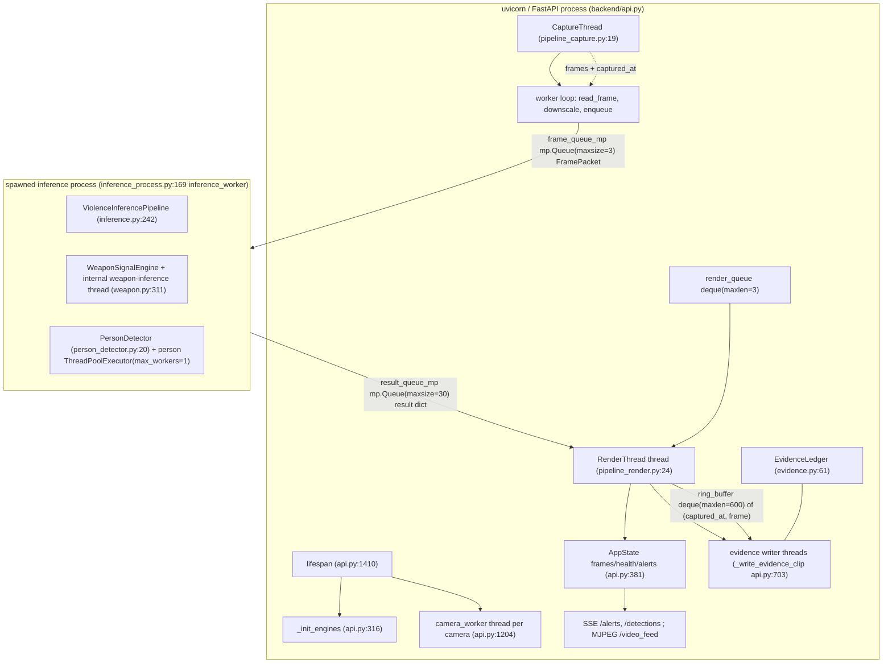

# AI Sentinel — active runtime map (verified from source)

**Baseline:** `e86d34b5d16abcc133ad3470c8d135d00b2423d4` (branch `final-demo-transfer`), read in worktree
`C:/Users/PCD/Downloads/jobs/sentinel-campaign/wt-01` (branch `codex/sentinel-01-runtime-map`).
**Status:** scoped campaign artifact, not a canonical/status document (`docs/CURRENT.md` remains the sole status entry point).
**Evidence rule:** every claim below is either `path:line` from this commit, or from a *recorded* measurement whose
revision is named, or explicitly marked `UNVERIFIED` / `UNKNOWN`. A file existing does not prove wiring.

Verification commands and raw outputs: `docs/blueprint/runtime-map-verification.md` (V-01 … V-22).
Ownership slices for downstream agents: `docs/blueprint/ownership-map.md`.

---

## 0. Baseline integrity findings (read this before trusting anything else)

| # | Finding | Evidence |
|---|---|---|
| B-1 | **The committed API layer cannot be imported.** `backend/api.py` imports `go2rtc_bridge` (module scope, no guard) and `openrouter_reporting`; neither file is tracked by git at this commit. Both exist only as untracked files in the operator's dirty checkout. | `backend/api.py:46-50`, `backend/api.py:295-298`; `git ls-files \| grep -i "go2rtc\|openrouter"` → empty; `git -C "Final Project AI Sentinel" status --porcelain backend/go2rtc_bridge.py backend/openrouter_reporting.py` → `?? …` |
| B-2 | The canonical start command therefore fails in a clean checkout: `ModuleNotFoundError: No module named 'go2rtc_bridge'` at `backend/api.py:50`. | `python -m uvicorn api:app --port 18099 --app-dir backend` → traceback ending `backend/api.py:50: ModuleNotFoundError` |
| B-3 | The only harness that *can* import the app stubs those modules: `bench/runtime.py:229-284 install_benchmark_adapters()` injects `DisabledGo2RTCBridge` / `DisabledDeepSeekReportService` when `find_spec` fails, and records them in `benchmark-overrides.json`. Every recorded HTTP/throughput measurement ran with these adapters, not with the real services. | `bench/runtime.py:230-284`, `bench/results/perf-after-2026-09-26/benchmark-overrides.json` |
| B-4 | Other untracked runtime modules the operator's checkout has and the commit does not: `backend/_pipeline_ai_deprecated.py`, `backend/augmentations.py`, `backend/check_model_sha.py`, `backend/dataset_manager.py`, `backend/train_pipeline.py`, `backend/weapon_model_data.yaml`, `backend/tests/__init__.py`, and 9 untracked test files (`test_decision_layer.py`, `test_inference_process.py`, `test_pipeline_integration.py`, `test_onnx_switch.py`, `test_device_utils.py`, `test_authenticated_routes.py`, `test_eye_level.py`, `test_inference_cache.py`, `test_inference_lifecycle.py`). | `git -C "Final Project AI Sentinel" status --porcelain -uall backend/` |
| B-5 | The registered runtime evidence was measured at a **different revision** and honestly reports both backend drift and missing baseline files. Baseline report revision `6fb3bcac8be7adbc30086978b28b5fb26f541c16`; it records 43 backend files including untracked ones. | `bench/results/sprint2-verified-480p/report.json` → `environment.revision`, `environment.source_hashes` |
| B-6 | **`npm run docs:check` already fails at this commit** (2 stale generated docs) and therefore `npm run prebuild` → `next build` fails too. Cause: the generated docs were produced against the operator's checkout where the baseline-referenced untracked modules existed. | `node scripts/docs-contract.mjs --check` → `Stale generated document: docs/SOURCE-MANIFEST.json`, `…docs/CURRENT.md`; see §7. |
| B-7 | `backend/api.py` in the operator's checkout is *modified* relative to this commit (+263/−45, incl. a new 159-line block after `_drain_to_latest` and a `/security/session` route at dirty-copy line 2357). Downstream work must pin to the commit, not that copy. | `git -C "Final Project AI Sentinel" diff --stat -- backend/api.py` |
| B-8 | Duplicate/backup trees are tracked: `backend/احتياطي/{api,inference}.py`, `components/احتياطي/{dashboard-header,incident-panel,video-player}.tsx`; plus a saved web page `backend/Repository search results.html` + its 58 tracked `_files/*` assets, and `components/files{, (1)}.zip`. | `git -c core.quotepath=false ls-files \| grep احتياطي`; `git ls-files \| grep -c "Repository search results_files"` |
| B-9 | `docs/PLAN.md` contains double-encoded mojibake (`≥` instead of `≥`, 9 occurrences). Content is readable but the gate table's symbols are corrupted. | char scan of `docs/PLAN.md` |
| B-10 | **The committed test suite is not a usable baseline**: 5 tests assert behaviour the current code no longer has, `backend/tests/test_face_policy.py` installs a fake `torch` into `sys.modules` and poisons later tests in the same session, `test_weapon_accuracy.py` silently skips itself (wrong checkpoint path), and `test_face_policy.py` targets `/face/*` routes that exist nowhere in git. | §V-21, §V-22 |

**Consequence for 25+ downstream agents:** assume *nothing* runs out of the box. Decide per workstream whether the
deliverable is (a) "make the committed tree self-consistent" (B-1/B-4/B-6) or (b) "change behaviour". Do not treat
`bench/results/**` numbers as belonging to this revision (B-5).

---

## 1. Architecture and data flow

### 1.1 Process/thread topology

### 1.2 Boundary-by-boundary contract

| # | Boundary | Producer → consumer | Mechanism / size | Payload identity | Clock/timestamps carried | Anchor |
|---|---|---|---|---|---|---|
| D-1 | Source → capture | OpenCV `VideoCapture` → `CaptureThread` | `cv2.VideoCapture` per source; RTSP sets `OPENCV_FFMPEG_CAPTURE_OPTIONS` (`rtsp_transport;tcp, fflags;nobuffer, flags;low_delay, max_delay;0, analyzeduration;100000, probesize;50000`), USB sets `BUFFERSIZE=1`, 1280×720@30 | raw BGR frame | none (source clock only via `CAP_PROP_FPS`) | `pipeline_capture.py:40-70`; duplicate/older helper `api.py:1090-1136` (`_open_capture`, **unused**) |
| D-2 | Capture loop → render queue | `camera_worker` → `RenderThread` | `deque(maxlen=3)`, `frame.copy()`, `frame_available` Event | raw BGR frame | `captured_at = time.monotonic()` at read | `api.py:1262-1330` |
| D-3 | Capture loop → evidence ring | `camera_worker` → evidence writers | `deque(maxlen=600)` of `(captured_at, frame)`, 5 s window by monotonic time; per-alert `queue.Queue(maxsize=360)` post-window | frame downscaled to max-side 960 | monotonic `captured_at` | `api.py:1270-1290`, `api.py:1213`, `api.py:1266` |
| D-4 | Capture loop → inference process | `mp.Queue(maxsize=3)` (`spawn`) | `FramePacket(frame, sequence, captured_at, source_width, source_height, source_fps, decision_config, sample_timestamp)`; frame pre-downscaled to max-side 640 | `sequence` = capture-loop counter; `sample_timestamp` = `source_epoch + file_frame_index/source_fps` **only for files**, else `None` | `captured_at` (monotonic), `sample_timestamp` (media clock, file only), `source_fps`, `decision_config` snapshot | `temporal_frames.py:9-22`; `api.py:1278-1296`; `temporal_frames.py:53-59` (`downscale_for_inference`); `inference_process.py:326-333` (`window_clock_source`) |
| D-5 | Inference process → render thread | `mp.Queue(maxsize=30)` | result dict (§1.3) | `inference_sequence`, `violence_observation_id`, `weapon_observation_id`, `inference_sample_time`, `inference_generation` | `capture_timestamp`, `source_sample_timestamp`, `violence_capture_timestamp`, `processing_latency_ms` | `inference_process.py:427-455`; `pipeline_render.py:78-99` |
| D-6 | Render → decision layer | `RenderThread._observe` → `LiveAlertDecisionLayer.update(score, sample_time, sample_id, current_time)` | in-process call under RLock; one call per queued observation (all queued results consumed per render, ≤30) | `sample_id` = producer `inference_sequence`; `sample_time` = `inference_sample_time` | monotonic decision clock; producer sample clock | `pipeline_render.py:101-120`; `live_alert_decision.py:112-170` |
| D-7 | Render → alert fan-out | `_emit_alert` → `on_threat` (`state.register_alert`, thumbnail write, local report, `broadcast_alert`) | in-process; JPEG re-encode at Q85 | alert dict (§1.4) | `isoTime` (UTC wall clock) + `alertLatencyMs` (perf_counter delta) | `pipeline_render.py:186-250`; `api.py:1248-1264` |
| D-8 | Render → alert SSE | `state.broadcast_alert` → `queue.Queue(maxsize=128)` per subscriber → `_sse_generator` | SSE `text/event-stream`, JSON per `data:` line | alert dict, plus `{"type":"person_detection", …}` envelopes | `timestamp` (`HH:MM:SS UTC`), `isoTime` | `api.py:459-497`, `api.py:1500-1518`, `api.py:1589-1591` |
| D-9 | Render → detection SSE | `state.set_detection_meta` → `_detection_sse_generator` polls every 0.1 s, emits only on change | SSE; per-camera snapshot | detection dict (§1.5) | `updatedAt` = `time.time()` seconds; `window.clockSource ∈ {file-media, monotonic-capture}` | `api.py:1594-1643`; `pipeline_render.py:158-166` |
| D-10 | Render → MJPEG | `state.set_frame` → `state.wait_for_frame(sequence, timeout)` → `_mjpeg_generator` | multipart JPEG stream, downscaled to width 854, quality from `STREAM_QUALITY` | `(sequence, jpeg_bytes)` | none | `pipeline_render.py:150-156`; `api.py:1492-1498`, `api.py:1553-1558` |
| D-11 | Alert → evidence clip | `_emit_alert` → `on_evidence` → `_write_evidence_clip` on its own daemon=False thread | pre-window copy + `post_queue` (maxsize 360), deadline = trigger + 5.0 s, `encode_browser_mp4(timeout=12.0)` | file `EVIDENCE_DIR/{alert_id}.mp4` via `.part.mp4` atomic `replace` | resampled from `captured_at`; ledger stores file hashes | `api.py:721-822`; `pipeline_render.py:242-250`; `evidence_video.py:287-400` |
| D-12 | Clip finalized → ledger | `_write_evidence_clip` → `EvidenceLedger.append_entry` | JSONL append + `os.fsync`, cross-instance RLock per canonical path | SHA-256 of clip/snapshot/report text | ISO-8601 UTC `timestamp` | `evidence.py:110-166` |
| D-13 | Ledger → API | `GET /evidence_chain/{alert_id}` | replay + full hash-chain verification on each read | ledger record verbatim | → | `api.py:2158-2166`; `evidence.py:82-108` |

### 1.3 Inference-process result payload (`inference_process.py:427-455`)

`is_threat`, `threat_confidence` (0–100), `violence_conf` (0–1, EMA-smoothed calibrated), `weapon_score` (0–1),
`weapon_labels: str[]`, `weapon_bbox` (normalized xyxy or null), `tracks` (source-pixel xyxy + track id),
`person_count` (**derived as `len(tracks)`, not a tracker total**), `motion_score` (context only), `video_width`,
`video_height`, `frame_idx` (per-epoch), `timestamp` (wall clock), `fps` (**always `0.0` from `default_result()`; the
render thread substitutes a measured value from `OverlayCache`**),
`inference_sequence` (monotonic, `max(prev+1, sample_time*1e6)`), `inference_sample_time`,
`inference_generation` (bumped at media-loop reset), `violence_observation_id`, `weapon_observation_id`,
`violence_capture_timestamp`, `violence_observation_age_ms`, `weapon_observation_age_ms`, `observation_score`,
`observation_valid`, `capture_timestamp`, `processing_latency_ms`, `window_span_seconds`, `window_valid`,
`window_clock_source`, `source_sample_timestamp`, `frames_collected`, `frames_required` (32), `pipeline_health`,
`decision_config`.
Health states produced: `OK`, `DEGRADED`, `FAILED`, `DISABLED`, `STALE`, `DEGRADED/Delivery queue full`,
`DEGRADED/Invalid runtime policy update`; staleness bound `MODALITY_STALE_AFTER_SECONDS = 5.0`.

### 1.4 Alert payload (SSE `/alerts`, `pipeline_render.py:215-233`)

`id` (`alert-<epoch_ms>-<6 hex>`), `timestamp`, `isoTime`, `confidence`, `modelConfidence`, `threatConfidence`,
`rawModelConfidence`, `calibratedConfidence` (**`null`** in this path), `calibrationStatus: "unverified"`,
`threatType ∈ {violence, weapon}`, `type ∈ {Violence, Weapon}` (**note: never `Weapon Detection` in this path**),
`severity` (from `DecisionConfig.severity_for`, can be `none`), `cameraId`, `location`,
`fusionScore`, `fusionModel: "rule_based"`, `weaponDetectorReady`, `fusionReason`, `motionScore`, `weaponScore`,
`personCount`, `weaponLabels`, `alertLatencyMs: null`, `alertState`, `confirmedAlert: true`, `confirmRule`,
`decisionLayer` (nested full decision status), `weaponBbox`, `violenceBbox`, `alertVideoWidth`, `alertVideoHeight`.
Legacy second builder `_generate_alert_payload` (`api.py:898-1000`, used only by tests) emits a *different* field set
(camel+snake duplication, populated `alertLatencyMs`, `fusion_engine.assess`). Which builder a given runtime path uses:
`_emit_alert` only.

### 1.5 Detection payload (`GET /detections`, `api.py:1594-1622`)

`cameraId`, `sourceKind ∈ {file, live}`, `updatedAt` (epoch seconds), `inferenceSequence`, `violenceSequence`,
`weaponSequence`, `tracks[{id, bbox, confidence, color}]`, `personCount`, `isThreat`, `threatConfidence` (0–100),
`fps`, `violenceScore`/`weaponScore` (**`null` until a producer observation id exists**), `videoWidth`,
`videoHeight`, `multiThreat` (from fusion `assess_multi_threat`), `health{capture, violence, weapon, person, decision, render}`,
`latencyMs`, `window{framesCollected, framesRequired, spanSeconds, valid, clockSource}`,
`decision{alertState, confirmedAlert, watchThreshold, confirmThreshold, weaponThreshold, rollingWindowCount, confirmN, confirmM, cooldownRemainingSeconds}`,
`calibrationStatus: "unverified"`. `alertState` is translated `CONFIRMED_VIOLENCE → CONFIRMED` (`api.py:1601`).

### 1.6 Module inventory (runtime-relevant)

| Module | Role | Wired? |
|---|---|---|
| `backend/api.py` (2280 lines) | FastAPI app, AppState, camera workers, evidence, routes | entry point (blocked by B-1) |
| `backend/inference_process.py` | spawned worker owning all models | yes (via `camera_worker`) |
| `backend/inference.py` | violence (SlowFast/X3D) pipeline, window/stride/EMA/hysteresis | yes |
| `backend/weapon.py` | weapon engine + YOLO/ONNX/torchvision backends | yes |
| `backend/person_detector.py` | person detection/tracking overlay | yes (overlay only) |
| `backend/yolo_onnx.py` | ONNX letterbox/decode/NMS/thread options | yes (both ONNX backends) |
| `backend/pipeline_capture.py` | `CaptureThread` | yes |
| `backend/pipeline_render.py` | `RenderThread`, decision consumption, alert emit | yes |
| `backend/frame_pipeline.py` | `OverlayCache`, `FrameRingBuffer` | `OverlayCache` yes; `FrameRingBuffer` **unused** |
| `backend/temporal_frames.py` | `FramePacket`, `TemporalWindow`, `downscale_for_inference` | `FramePacket`/`downscale_for_inference` yes; `TemporalWindow` **unused** (window logic inlined in `inference.py:511-545`) |
| `backend/live_alert_decision.py` | temporal confirmation/cooldown | yes |
| `backend/decision_config.py` | validated policy dataclass; sole TOML reader | yes |
| `backend/fusion.py` | severity + fusion-v2 + multi-threat boxes | yes |
| `backend/evidence.py` | hash-chained ledger | yes |
| `backend/evidence_video.py` | strict H.264/yuv420p MP4 encode+verify | yes |
| `backend/notifications.py` | Telegram queue + delivery | yes |
| `backend/security.py` | API-key auth, audit JSONL | yes |
| `backend/audio.py` | WAV risk analysis | yes (`/audio/*` only) |
| `backend/reporting.py` | Arabic PDF incident report | yes (`/download_report`) |
| `backend/local_forensics.py` | offline Arabic facts-only text | yes |
| `backend/detection_categories.py` | category capability/context analyzer | yes (`/api/categories`, `/api/analyze`) |
| `backend/metrics.py` | `pipeline_metrics` | read-only consumer; **never written** |
| `backend/webrtc_streamer.py` | aiortc manager | partial (needs `aiortc`) |
| `backend/pipeline_ai.py` | shim re-export of `estimate_motion_score` | import-only |
| `backend/optimization.py` | `cached_resize` (no caching) | shim |
| `backend/face_intel.py` | face registry/policy engine | **disconnected** (no route, no caller) |
| `backend/go2rtc_bridge.py`, `backend/openrouter_reporting.py` | required imports | **missing from git** (B-1) |
| `backend/colab_bridge_server.py`, `export_models.py`, `prepare_colab_bundle.py`, `render_colab_notebook.py`, `train_*.py`, `training/`, `datasets/`, `tools/` | offline training/eval/ops | not runtime |
| `backend/احتياطي/{api,inference}.py` | tracked backup copies of `api.py`/`inference.py` | not imported |
| `components/احتياطي/{dashboard-header,incident-panel,video-player}.tsx` | tracked backup copies of live components | not imported |

---

## 2. Feature inventory (stable IDs)

Legend — `wiring`: `implemented-active` (reachable from the running app), `partial` (runs but with a known contract
or coverage gap), `disconnected` (code exists, no live caller), `proposed` (declared only), `unverified` (not measured).
`tests` lists the committed test files that actually exercise the feature; empty means no covering test exists at this commit.

| ID | Feature | Source refs | Entry point(s) | Depends on | Config keys | API / event contract | Covering tests | Wiring |
|---|---|---|---|---|---|---|---|---|
| F-01 | Runtime policy bootstrap (single threshold source) | `backend/decision_config.py:19-94`, `config/thresholds.toml` | `load_decision_config()`; `AppState.__init__` | tomllib | whole `config/thresholds.toml` | `GET/POST /decision/config` → `{policy, persistence:"runtime"}` | `backend/tests/test_api_runtime_config.py`, `test_decision_observations.py` | implemented-active |
| F-02 | YAML/env application config | `backend/api.py:116-118`, `backend/api.py:286-338` | module import | `PyYAML`, `python-dotenv` | `backend/config.yml` all sections | — | `test_api_runtime_config.py` | partial (several keys dead, see §4.3) |
| F-03 | Camera source resolution | `backend/api.py:160-255` | `_load_camera_sources()` | `camera_profiles.yml` optional | `CAMERA_PROFILES_PATH`, `CAM1_SOURCE`, `CAM2_SOURCE`, `DEFAULT_CAMERA_ID` | `GET /cameras/status` → list of `{cameraId, source, status, …}` | `test_demo_clips.py` | implemented-active |
| F-04 | Bounded capture thread | `backend/pipeline_capture.py:19-142` | `CaptureThread.open/read_frame/reconnect` | OpenCV | via source type | — | — | implemented-active (`push_frame`, `_drain_to_latest` unused) |
| F-05 | Frame downscale + IPC envelope | `backend/api.py:1276-1296`, `temporal_frames.py:53-59` | `camera_worker` loop | numpy/cv2 | `AI_SENTINEL_FILE_SKIP` | `FramePacket` fields (D-4) | `test_resize_pixel_contract.py`, `test_api_sprint.py` | implemented-active |
| F-06 | Per-camera inference process (CUDA isolation) | `backend/api.py:1244-1250`, `inference_process.py:169` | `mp.Process(target=inference_worker)` (`spawn`) | torch, onnxruntime | `person_interval`, `weights_path`, `violence_stride` | frames in / results out (D-4, D-5) | `test_inference_optimization.py` (mocked), `test_latency.py` | implemented-active |
| F-07 | Violence inference (SlowFast `ViolenceDetector` / X3D fallback) | `backend/inference.py:242-556` | `ViolenceInferencePipeline.process_frame` | torch, `backend/best_model.pt` | `WEIGHTS_PATH`, `STRIDE`, `VIOLENCE_CLASS_INDEX`, `VIOLENCE_LOGIT_TEMPERATURE`, `VIOLENCE_LOGIT_BIAS`, `VIOLENCE_CONFIDENCE_EMA_ALPHA`, `VIOLENCE_HYSTERESIS_MARGIN`, `AI_SENTINEL_VIOLENCE_*` | `_last_conf`, `_last_raw_conf`, `_last_calibrated_conf`, `window_status` | `test_inspect_model_checkpoint.py`, `test_runtime_observation_contract.py`, `test_resize_pixel_contract.py` | implemented-active |
| F-08 | Temporal window validity (±10 % span, gap bound) | `backend/inference.py:511-545`, `temporal_frames.py:25-46` | `process_frame` | source timestamps | nominal fps | `window{framesCollected,framesRequired,spanSeconds,valid,clockSource}` | `test_decision_observations.py`, `test_eof_discontinuity.py` | implemented-active (`TemporalWindow` class itself unused) |
| F-09 | Weapon inference engine | `backend/weapon.py:63-615` | `WeaponSignalEngine.process_frame/latest_signal` | onnxruntime / ultralytics / torchvision | `WEAPON_*` (12 vars, §4.2), `weapon:` block | `latest_signal()` dict (`score`, `labels`, `bbox`, `observation_id`, `observation_age_ms`, `isRealtime`, …) | `test_weapon_category.py`, `test_weapon_observation_contract.py`, `test_weapon_accuracy.py`, `test_weapon_smoke_tool.py` | implemented-active (interval 8 default vs config 20 vs measured 4 — env-driven) |
| F-10 | Person detection/tracking overlay | `backend/person_detector.py:20-253` | `PersonDetector.detect` | `backend/models/person_yolo.onnx` (ONNX) or `yolov8n.pt` (fallback) | `PERSON_OVERLAY_ENABLED`, `PERSON_OVERLAY_CONF`, `PERSON_INFER_INTERVAL` | `tracks[{id,bbox,confidence,color}]`, `personCount` | `test_yolo_onnx_contract.py`, `test_live_visual_pipeline.py` | partial (ByteTrack path unmeasured; ONNX path measured) |
| F-11 | Motion score (context only) | `backend/inference_process.py:52-84`, `fusion.py:96-118` | `_score_motion_thumbnails` | cv2 | — | `motion_score`; `fusion.motionScore`; `motion_weight` forced 0 | `test_motion_score.py` | implemented-active |
| F-12 | Result queue + observation identity | `backend/inference_process.py:359-455`, `pipeline_render.py:78-99` | `result_queue.put` / `_pull_mp_results` | mp | — | `inference_sequence`, `*_observation_id`, `observation_valid` | `test_decision_observations.py`, `test_eof_discontinuity.py` | implemented-active |
| F-13 | Display/render + MJPEG encode | `backend/pipeline_render.py:121-184`, `api.py:1492-1498` | `RenderThread._render_frame` | cv2 | `STREAM_QUALITY` (`low/medium/high` → 50/75/90) | MJPEG `multipart/x-mixed-replace`; JPEG downscale to 854 wide | `test_api_sprint.py` (sequence advance) | implemented-active |
| F-14 | Per-camera decision layer (N-of-M + cooldown) | `backend/live_alert_decision.py:23-223`, `api.py:424-431, 645-676` | `LiveAlertDecisionLayer.update/status` | monotonic clock | `watch_threshold`, `confirm_threshold`, `confirm_n`, `confirm_m`, `cooldown_seconds`, `min_decision_interval_seconds`, `history_max_age_seconds` | response dict (`alert_state`, `confirmed_alert`, `confirm_rule`, `rolling_history`, `cooldown_remaining_seconds`, `ignored_reason`, …) | `test_decision_observations.py`, `test_api_sprint.py`, `test_runtime_contracts.py` | implemented-active |
| F-15 | Fusion / severity | `backend/fusion.py:23-145` | `ThreatFusionEngine.assess`, `assess_multi_threat` | `DecisionConfig` | `fusion_*` keys in TOML; `fusion.enabled` in YAML | `{score, severity, violenceScore, motionScore, weaponScore, weaponEnabled, reason, calibrationStatus}`; `multiThreat{...threatBoxes}` | `test_threat_dispatch.py` | implemented-active (YAML weights ignored) |
| F-16 | Alert emission (snapshot + local report + fan-out) | `backend/pipeline_render.py:186-250`, `api.py:1248-1264` | `RenderThread._emit_alert` → `on_threat` | cv2, `local_forensics` | — | alert dict §1.4; thumbnail `THUMBNAILS_DIR/{id}.jpg` | `test_threat_dispatch.py` | implemented-active |
| F-17 | Alert SSE + person-count event | `backend/api.py:459-497`, `1500-1518`, `1589-1591` | `GET /alerts` | queue per subscriber (`maxsize=128`) | — | SSE JSON alert dict; `{"type":"person_detection","cameraId","personCount","trackIds","isThreat","videoWidth","videoHeight"}` | `test_decision_observations.py` (queue semantics) | implemented-active (**`broadcast_person_data` has no caller — person counts are never broadcast**) |
| F-18 | Detection metadata SSE | `backend/api.py:1594-1643` | `GET /detections?camera_id=` | `AppState._detection_meta` | — | §1.5 | `test_api_sprint.py` | implemented-active |
| F-19 | MJPEG stream | `backend/api.py:1553-1558` | `GET /video_feed?camera_id=` | `state.wait_for_frame` | `STREAM_QUALITY` | MJPEG | — | implemented-active |
| F-20 | Demo clip analysis on demand | `backend/api.py:1646-1692`, `247-260` | `POST /demo_start/{clip_id}`, `DELETE /demo_stop/{clip_id}`, `GET /demo_video/{clip_id}` | `demo_assets/videos/*.avi` | — | worker stop-event registry `state.is_demo_worker_running` | `test_demo_clips.py`, `test_eof_discontinuity.py` | implemented-active (clip files are LFS-tracked AVIs) |
| F-21 | Evidence clip writer | `backend/api.py:703-822`, `evidence_video.py:287-400` | `_write_evidence_clip` on alert | ffmpeg (`AI_SENTINEL_FFMPEG` or bundled `imageio-ffmpeg`) | `storage.evidence_dir` | `EVIDENCE_DIR/{alert_id}.mp4`; encoder `ffmpeg/libx264`, `-pix_fmt yuv420p`, `-movflags +faststart`, probe-verified H.264 | `test_api_sprint.py`, `test_evidence_video.py` | implemented-active |
| F-22 | Evidence ledger (chain of custody) | `backend/evidence.py:61-178` | `append_entry` / `get` | — | `storage.evidence_ledger_path` | `GET /evidence_chain/{id}` → record with `prevHash`/`currentHash`, `clipSha256`, `snapshotSha256`, `reportSha256`, `reportTextSha256` | `test_evidence_ledger_concurrency.py`, `test_api_sprint.py` | implemented-active (single-process only) |
| F-23 | Clip listing & streaming | `backend/api.py:1694-1736` | `GET /api/clips/list`, `GET /clips/{id}` | `EVIDENCE_DIR` | — | `{clips:[{alertId,clipUrl,timestamp,cameraId,type,confidence,severity,size,mtime}],count}` | `test_api_sprint.py` | implemented-active (excludes `*.part.mp4`) |
| F-24 | Evidence download (status-gated) | `backend/api.py:2123-2140` | `GET /download_evidence/{id}` | `state._evidence_status` | — | 202 `writing`, 500 `error`, else MP4 | `test_api_sprint.py` | implemented-active |
| F-25 | PDF incident report | `backend/reporting.py:113-…`, `api.py:2012-2068` | `GET /download_report/{id}` | reportlab, Arabic shaping, snapshot/clip assets | `storage.reports_dir` | PDF at `REPORTS_DIR/{id}.pdf`; also appends ledger entry | — | implemented-active (unmeasured) |
| F-26 | DeepSeek/OpenRouter report service | `api.py:295-300`, `1957-2010` | `GET /reports/deepseek/status`, `POST /reports/deepseek/test`, `POST/GET /reports/deepseek/{id}` | **`openrouter_reporting` (missing, B-1)** | `OPENROUTER_*` | `{…}` from service; cached under `REPORTS_DIR` | — | unverified (module absent; bench stubs it) |
| F-27 | Groq VLM forensic text | `backend/api.py:835-896` | `_call_vlm_forensics` | `groq` SDK | `GROQ_API_KEY` | would broadcast `{"type":"VLM_Report"}` | — | **disconnected (no caller anywhere)** |
| F-28 | Offline Arabic facts-only report | `backend/local_forensics.py:1-24`, `api.py:2090-2106` | `GET/POST /reports/local/{id}` | — | — | plain-text Arabic; explicitly states no image analysis | `tests/local-report.test.mjs` (frontend side) | implemented-active |
| F-29 | Category capability API | `backend/detection_categories.py:210-400`, `api.py:1738-1810` | `GET /api/categories`, `POST /api/analyze`, `POST /api/categories/{id}/toggle` | `weapon_engine` global | `categories:` block | capability dict `{id,label,enabled,status ∈ {active,experimental,unsupported},threshold,reason,requiresContext,requiredInputs}` | `test_categories.py`, `test_api_categories.py`, `test_intrusion_category.py`, `test_intrusion_api_contract.py` | partial (**violence labelled "Connected to active X3D temporal engine" while the measured runtime loads SlowFast** `detection_categories.py:240-243`; `/api/analyze` with `weapon` calls the shared `weapon_engine.process_frame`, injecting an extra live observation) |
| F-30 | Face intelligence | `backend/face_intel.py:39-926` | none | face detector backend | `FACE_INTEL_*`, `face_intel:` block | none at this revision | `test_face_policy.py`, `test_face_policy_persistence.py` | **disconnected** (zero references outside its own tests; `bench/runtime.py:316` force-disables it). The tracked test drives `/face/policy`, `/face/status`, `/face/policy/reload`, `/face/registry/*` — routes that exist **nowhere in the committed source** (only in an untracked `.runlogs/` snapshot inside the operator's checkout; V-22) |
| F-31 | Audio risk analysis | `backend/audio.py:33-156`, `api.py:2168-2183` | `POST /audio/analyze`, `GET /audio/status` | numpy/wave | `audio.enabled`, thresholds | `{enabled,detected,score,…}` | — | partial (no UI caller; `audio.enabled: false`) |
| F-32 | Telegram notifications | `backend/notifications.py:46-467`, `api.py:1813-1888` | enqueue from `on_threat`; `/notifications/*` routes | Telegram Bot API (requests) | `TELEGRAM_*` (7 vars), `notifications.telegram.*` | `status()`; queue `maxsize=128` | — | partial (untested; `min_severity: high`) |
| F-33 | API-key auth | `backend/security.py:27-66` | `security_controller.authorize` | — | `ADMIN_API_KEY`, `security.api_key` | header `X-API-Key`; 401/503 semantics; client role headers ignored | `test_security_contract.py` | implemented-active |
| F-34 | Audit log | `backend/security.py:88-150`, `api.py:2148-2156` | `audit_logger.record` | — | `security.audit_log_path` | `GET /audit/status`, `GET /audit/recent?limit=` | — | implemented-active (no frontend consumer) |
| F-35 | Runtime policy mutation API | `backend/api.py:2074-2122`, `2234-2264` | `GET/POST /decision/config`, `POST /set_threshold`, `POST /set_cooldown`, `POST /decision_layer/reset` | — | — | validated `DecisionConfig` round-trip; `ThresholdRequest(th 0.10–0.95)`, `CooldownRequest(0–120)` | `test_api_sprint.py`, `test_api_runtime_config.py` | implemented-active |
| F-36 | System status/metrics | `backend/api.py:2186-2232` | `GET /system/status`, `GET /system/metrics`, `GET /health` | all engines | — | status includes `decisionLayer`, `weapon`, `security`, `audit`, `audio`, `storage` | `test_api_runtime_config.py` | partial (**`/system/metrics` always returns zeros — `pipeline_metrics` is never recorded**, `metrics.py:1-49` read at `api.py:2218-2225`) |
| F-37 | WebRTC transport | `backend/api.py:1520-1575`, `webrtc_streamer.py:1-99` | `/api/webrtc/{cam}`, `POST/PATCH /api/webrtc/{cam}/whep`, `POST /webrtc/offer/{cam}` | `go2rtc_bridge` (missing) + optional `aiortc` | `webrtc:` block | metadata/WHEP proxy; 503 when bridge down | — | disconnected in practice (`webrtc.enabled: false`; bridge module absent) |
| F-38 | Camera health surface | `backend/api.py:531-548`, `1577-1587`, `1059-1080` | `GET /cameras/status`, `state.get_camera_health` | — | — | `{status ∈ STARTING/OK/DEGRADED/FAILED/STOPPED/UNAVAILABLE, reason}` | — | implemented-active |
| F-39 | File-loop boundary reset | `backend/api.py:1163-1202, 1304-1332`, `inference_process.py:248-290` | worker EOF branch + `mp_reset_event/mp_reset_ack` | mp events | — | drops queues/ring/decision state; acks within 2 s else `DEGRADED` | `test_eof_discontinuity.py` | implemented-active |
| F-40 | Calibration profile ingestion | `backend/calibration_utils.py:9-25`, `inference.py:148-152` | `load_calibration_profile` | — | `MODEL_CALIBRATION_PATH` | feeds `classIndex`, `logitTemperature`, `logitBias`, `emaAlpha`, `hysteresisMargin` | `test_decision_observations.py` (marginal) | partial (**`backend/model_calibration.json` does not exist** → `{}` defaults; worker marks calibration `DEGRADED` at `inference_process.py:222`) |
| F-41 | Frontend shell / dashboard | `app/page.tsx:1-…`, `components/shell/*`, `components/sections/*`, `components/overview/*` | `/` | Next 16.1.6, React 19.2.4 | `NEXT_PUBLIC_API_BASE_URL`, `NEXT_PUBLIC_SSE_URL` | reads `/alerts`, `/detections`, `/system/status`, `/api/clips/list`, `/api/categories`, `/reports/*`, `/set_threshold`, `/set_cooldown`, `/download_*`, `/evidence_chain/*` | `tests/e2e/test_operator_flows.py`, `components/overview/overview-time.test.mjs`, `components/shell/locale.test.mjs` | implemented-active (cannot be served by this commit's backend, B-1) |
| F-42 | Frontend alert store + envelope validation | `lib/sentinel-store.tsx:53-140`, `lib/sentinel-selectors.ts:44-100` | `SentinelProvider`, `parseAlertEnvelope` | EventSource | `NEXT_PUBLIC_SSE_URL` | accepts `type ∈ {Violence, Weapon, Weapon Detection}` and `severity ∈ {critical, high, medium}`; **rejects `severity:"none"`** and any malformed field | `tests/api-auth.test.mjs` (source-text), `lib/__tests__/sentinel-selectors.test.mjs` | partial (contract mismatch risk, §6/R-3) |
| F-43 | Frontend telemetry / overlay freshness | `hooks/use-detection-stream.ts:13-107`, `lib/pipeline-telemetry.ts:1-…`, `lib/detection-envelope.ts:104-…`, `components/canvas-overlay.tsx` | `useDetectionStream(cameraId)` | EventSource | — | 5 s transport staleness, per-modality completion IDs, `DecisionState ∈ {NORMAL,WATCH,CONFIRMED,COOLDOWN}` | `tests/pipeline-telemetry.test.mjs` (14), `tests/visual-state.test.mjs` (10), `tests/detection-envelope.test.mjs` (3) | implemented-active |
| F-44 | Frontend clip/evidence UX | `components/clip-sidebar.tsx:44-130`, `components/incident-replay.tsx:54`, `components/incident-panel.tsx` | dashboard sections | — | — | `/api/clips/list`, `/clips/{id}`, `/download_evidence/{id}`, `/download_report/{id}`, `/evidence_chain/{id}` | `tests/e2e/test_operator_flows.py` | implemented-active |
| F-45 | Frontend API-access credential flow | `hooks/use-api-access.ts:29`, `components/api-access.tsx:23`, `lib/api-auth.ts:9-51` | `GET /security/session` | sessionStorage | `NEXT_PUBLIC_ADMIN_API_KEY` | sends `X-API-Key` to the API origin only | `tests/api-auth.test.mjs` (source-text only) | **partial/broken: `/security/session` has no route at this commit** |
| F-46 | Docs contract generator/checker | `scripts/docs-contract.mjs:1-19`, `scripts/docs_contract.py:1-157` | `npm run docs:sync` / `docs:check` (also `prebuild`) | `venv` python or `py` | `docs/authority.json` | regenerates `docs/{SOURCE-MANIFEST.json,design-tokens.json,DESIGN.md,design-preview.html,CURRENT.md}`; fails on unregistered `docs/**/*.md` | `tests/docs_contract/test_docs_contract.py` | implemented-active (**already failing at this commit**, B-6) |
| F-47 | Bench harness (measurement) | `bench/runtime.py:169-487`, `bench/run.py`, `bench/calibrate.py`, `bench/probe.py`, `bench/security_scan.py`, `bench/common.py` | `py -m bench.run …` | torch/onnxruntime/httpx/psutil | `SENTINEL_BENCH_*` | writes `bench/results/<run>/report.json` | `bench/test_*.py` (6 files) | implemented-active (revision-pinned evidence, B-5) |
| F-48 | Training / dataset tooling | `backend/train_finetune.py`, `train_calibration.py`, `training/`, `datasets/`, `backend/tools/*` | scripts | torch, manifest datasets | dataset configs | n/a | `test_dataset_loader.py`, `test_manifest_dataset.py`, `test_rwf2000_manifest.py`, `test_train_*` | implemented-active (offline; not runtime) |
| F-49 | Colab/remote bridge | `backend/colab_bridge_server.py:1-147`, `start-colab-bridge.ps1`, `start-remote.ps1` | standalone server | fastapi/uvicorn | `COLAB_BRIDGE_HOST`, `COLAB_BRIDGE_PORT` | local tooling only | — | partial |

### 2.1 Negative findings (dead code, duplicates, mocks)

| N-# | Finding | Evidence |
|---|---|---|
| N-1 | Dead helpers in the API module (defined, never called anywhere in repo): `_open_capture`, `_read_cap_props`, `_drain_to_latest`, `_estimate_motion_score`, `_weapon_signal_from_report`, `_encode_snapshot`, `_is_rtsp_source`, `_call_vlm_forensics`, `AppState.update_decision_layer`. | grep counts = 1 occurrence each (`backend/api.py:1002,1013,1045,1086,1090,1138,1144,835,645`) |
| N-2 | `AppState.broadcast_person_data` (person detection event) has no caller → the `person_detection` SSE branch in the frontend store only fires for legacy producers. | `api.py:479-496` vs grep for callers = 0 |
| N-3 | `pipeline_metrics` is read but never recorded → `/system/metrics` returns zeros forever. | `backend/metrics.py:1-49`; only reference `api.py:2221` |
| N-4 | `temporal_frames.TemporalWindow` and `FrameRingBuffer` are unused duplicates of logic inlined elsewhere. | `temporal_frames.py:25-46`; `frame_pipeline.py:97-114` |
| N-5 | `CaptureThread.push_frame`/`_drain_to_latest` unused; the worker reads via `read_frame()` and manages queues itself. | `pipeline_capture.py:100-113, 87-98` vs `api.py:1262-1330` |
| N-6 | `inference_process.read_violence_signal` / `read_weapon_signal` are test-only helpers; the worker inlines the logic. | `inference_process.py:94,121`; callers only in `backend/tests/test_live_visual_pipeline.py` |
| N-7 | Two tracked backup trees (`احتياطي/`) duplicate live backend and frontend files; `frontend/` is a 1-file README; `archive/` holds 3 READMEs. | `git -c core.quotepath=false ls-files`; `git ls-files frontend archive` |
| N-8 | Repo hygiene: tracked `backend/Repository search results.html` + 58 `_files/*` browser-save assets, `components/files.zip`, `components/files (1).zip`, `docs/AI_Sentinel_Phase2_Midterm_Deck.pptx`, `backend/best_model.pt` (149 MB), `backend/weapon_hadi_yolo.pt`, 3 demo AVIs. | `git ls-files` filter |
| N-9 | Frontend "test" `tests/api-auth.test.mjs` asserts on source text (6 `readFile`+regex asserts) rather than behaviour; the other 10 `.mjs` suites are behavioural. No npm script runs any `.mjs` test. | file contents; `package.json` scripts |
| N-10 | `backend/tests/test_inference_optimization.py`, `test_multi_angle_benchmarks.py`, `test_intrusion_api_contract.py` are mock-based (`unittest.mock`, MagicMock engines) → they pin wiring shapes, not model behaviour. | test imports |
| N-11 | `docs/PLAN.md` symbol corruption (B-9) and `backend/.env.example` documents `CORS_ORIGINS`, which no code reads (`api.py:1487` uses `config['server']['cors_origins']`). | grep `CORS` in `backend/*.py` → only middleware + config usage |
| N-12 | Backend test suite has no single documented invocation: from `backend/` 8 files fail to import (`No module named 'backend'`); from repo root they collect (283 tests) but 22 API tests then error on B-1. | §7 verification runs |
| N-13 | 5 tracked tests assert superseded behaviour and cannot pass against the current implementation: `test_weapon_category.py::test_weapon_engine_cooldown_skipping` (wall-clock vs monotonic gating), both `test_multi_angle_benchmarks.py` bulk tests (`tools.benchmark_threat_latency` unresolvable — `backend/tools/` has no `__init__.py`), both `test_latency.py` tests (`_sample_times` missing on ad-hoc pipeline construction), `test_demo_clips.py::test_all_three_avi_files_exist` (resolves `test/*.avi` while the code uses `demo_assets/videos/`). | §V-21 |
| N-14 | `backend/tests/test_face_policy.py:18-39` injects a fake `torch` module into `sys.modules` at import time and restores it only from its own teardown; because its import path fails first (B-1) the fake survives and poisons later tests in the same pytest session (16 outcomes in V-21 R-4; each file passes in isolation). | §V-21 |
| N-15 | `test_weapon_accuracy.py` skips itself entirely: it resolves the weapon checkpoint at repo-root `best.pt`, not `backend/weapon_hadi_yolo.pt` / `backend/models/weapon_yolo.onnx` (18 skips). | §V-21 R-7 |
| N-16 | `backend/tools/` has no `__init__.py` (namespace package) while `backend/datasets/` and `backend/training/` do — inconsistent package layout that breaks attribute-style imports. | `ls backend/tools/__init__.py` → absent |

---

## 3. Models and weights actually loaded

### 3.1 Files and hashes (read from the operator checkout, READ-ONLY, 2026-09-29)

| Asset | Path | Size (bytes) | SHA-256 | Tracked? |
|---|---|---|---|---|
| Violence checkpoint | `backend/best_model.pt` | 149 344 325 | `2c8222d3663a0ac54ed9e1c5b372378b771a8dd0f3c0ed1ed04cee4013620d01` | yes (LFS) |
| Weapon single-class .pt (legacy weight path) | `backend/weapon_hadi_yolo.pt` | 6 230 954 | `e85b15fe74a16de9ac98562a072a50bffdcda5a7fb6ef4d8594dc7de466ab6b5` | yes |
| Person YOLO ONNX | `backend/models/person_yolo.onnx` | 12 851 087 | `3fafb13e995667e7f877c647b33df05be6d587e75aa79d9cc34e9b3f493e60b8` | **no (untracked)** |
| Weapon YOLO ONNX | `backend/models/weapon_yolo.onnx` | 103 636 665 | `96991cd5d5dbeb7e8d439b3e5b75517bc8c55ea4ac740ec5bc8491d545875aef` | **no (untracked)** |
| Calibration artifact | `backend/model_calibration.json` | — | — | **absent** (F-40) |

Multi-MB weights are deliberately not committed by this campaign; downstream agents must copy them into their own
untracked `assets/` and cite these hashes.

### 3.2 File formats, taxonomies, and the provider decision

Measured with `onnxruntime 1.18.0` CPU provider (read-only load):

| Model | Input | Output | Class metadata | Declared output format |
|---|---|---|---|---|
| `person_yolo.onnx` | `images [1,3,640,640] float32` | `output0 [1,84,8400]` | COCO-80; id 0 = `person` (validated: `person_detector.py:88-90` raises if class 0 ≠ person) | `args={'nms': False,…}`, `end2end=false` → `"raw"` |
| `weapon_yolo.onnx` | `images [1,3,640,640] float32` | `output0 [1,10,8400]` | **6 classes: `0 pistol, 1 rifle, 2 shotgun, 3 knife, 4 sword, 5 revolver`** | `args={'nms': False,…}`, `end2end=false` → `"raw"` |

Provider selection is code, not config: `device_utils.get_onnx_providers()` returns
`[("CUDAExecutionProvider", {use_tf32:"0", cudnn_conv_algo_search:"HEURISTIC"}), "CPUExecutionProvider"]` when CUDA is
present, else CPU only (`device_utils.py:30-42`). TensorRT is **never** selected even though the project venv exposes
the TensorRT provider. `session_options()` pins `intra_op=2` (env `AI_SENTINEL_ORT_INTRA_OP_THREADS`, bounded 1–4),
`inter_op=1`, spinning disabled (`yolo_onnx.py:18-37`).
**Recorded runtime fact:** in the registered run both weapon and person ONNX sessions ran on
`["CPUExecutionProvider"]` and the violence model ran on `cuda:0` (`bench/results/sprint2-verified-480p/report.json`
→ `summary.models`, `docs/evidence.json` rationale: GPU ONNX was rolled back after integrated runs showed no active
inference). Any "GPU ONNX promoted" claim must be re-measured; it is **not** supported by the registered evidence.

### 3.3 Pre/post-processing contracts (exact)

Violence (`inference.py:181-240`, `511-545`):
- Window = **32 frames** (`WINDOW_SIZE`, `inference.py:118`); X3D path resizes to 182×182 → centre-crop 160×160,
  `BGR→RGB`, `/255`, normalise `MEAN=0.45, STD=0.225` per channel, tensor `(1,3,32,160,160)`.
- SlowFast path resizes to 224×224, same normalisation, `(1,T,3,224,224)`; slow pathway = `fast[:, ::4]`.
- Calibration: `margin = ((p_violence_logit − max(other_logits)) + logitBias) / max(0.05, logitTemperature)`, clipped
  ±20, `sigmoid` → "calibrated" score (`inference.py:485-508`). With no artifact, temperature 1.0 / bias 0.0 →
  equals the logit margin sigmoid, **not** a calibrated probability (`calibrationStatus: "unverified"` everywhere).
- EMA: only after `_counter > WINDOW_SIZE`; `ema_alpha` default 0.45.
- Hysteresis: state releases at `threshold − hysteresis_margin` (default 0.08).
- Inference is submitted asynchronously (`ThreadPoolExecutor(max_workers=1)`, `inference.py:257`) and is gated by
  `valid and counter % stride == 0`; `stride` = `STRIDE` env or `config.model.stride` (`api.py:265`; committed YAML
  says 8, registered run used 16).

Weapon (`weapon.py:262-310`, `yolo_onnx.py:84-158`):
- Letterbox to 640×640 with pad 114, `BGR→RGB`, `/255`, NCHW float32 (`yolo_onnx.py:84-104`).
- Raw decode: channels = `4 + num_classes`; `cxcywh→xyxy` (`cx ± w/2`); per-proposal argmax class; validity requires
  finite values and `0 ≤ score ≤ 1`; `post_nms` mode requires explicit `[N,6] xyxy/score/class`.
- Class-aware greedy NMS: `iou_threshold=0.5`, `max_detections=300`, ordering by score, **NMS applied in model space
  before border clipping** (unit-tested).
- Class filter: config `weapon.labels` substring-matched against model names (`weapon.py:305-308`). Committed
  `backend/config.yml` and `.env.example` list all six names; the dataclass default is only
  `("pistol","rifle","knife")` (`weapon.py:74`) — a config-less runtime would silently drop shotgun/sword/revolver.
- Async worker: one daemon thread, `queue.Queue(maxsize=1)`, gate `interval` frames **and** `min_interval_ms`,
  frame copied before hand-off; score EMA `ema_alpha`; exponential decay by half-life; `signal_ttl_ms` zeroes the
  signal; `independent_alert_threshold` 0.65 (`weapon.py:446-550`).

Person (`person_detector.py:112-253`): ONNX path decodes with `classes={0}`; tracker state is local (`_active_tracks`,
`_track_frame_count`, `_counted_ids`); YOLO/ByteTrack path only when ONNX is absent.

### 3.4 Thresholds / decision-config sources

Single authority: `config/thresholds.toml` read ONLY by `decision_config.load_decision_config()`
(`decision_config.py:19,93-94`). Committed values: `violence_threshold 0.45`, `weapon_threshold 0.55`,
`weapon_display_threshold 0.45`, `watch_threshold 0.45`, `confirm_threshold 0.65`, `confirm_n 2`, `confirm_m 3`,
`min_decision_interval_seconds 0.50`, `cooldown_seconds 3.0`, `history_max_age_seconds 10.0`, severity 0.40/0.65/0.85,
fusion weights 0.65/0.15 + boost 0.12 + strong floors 0.92/0.88. Runtime mutation is validated and propagated
(`api.py:504-560`, `2074-2122`). `backend/config.yml` still carries *competing* numeric values
(`model.confidence_threshold: 0.75`, `categories.violence_threshold: 0.75`, `fusion.*`, `weapon.independent_alert_threshold`)
that are either dead or limited to `enabled`-style flags (§4.3).

### 3.5 Temporal semantics summary

| Concept | Value / rule | Anchor |
|---|---|---|
| Violence window | 32 consecutive frames; valid iff `abs(span − (31/fps)) ≤ 10 %` and every gap `> 0` and `≤ 2.1/fps` | `inference.py:517-524` |
| Window clock for files | `captured_at = source_epoch + file_frame_index/source_fps` passed as `sample_timestamp` | `api.py:1270-1276`, `temporal_frames.py:22` |
| Window clock for live | monotonic capture time; `sample_timestamp=None` | `api.py:1276`, `inference_process.py:326-333` |
| Violence stride | frame counter % stride; default 8 (YAML), env override | `inference.py:539`, `api.py:265` |
| Weapon cadence | every `interval` frames (committed YAML 20, env 8 default, measured 4) **and** ≥ `min_interval_ms` | `weapon.py:74-78`, `446-480` |
| Person cadence | `person_interval` frames (env `PERSON_INFER_INTERVAL`, default 3) | `api.py:1239`, `inference_process.py:417` |
| Decision cadence | one vote per distinct producer observation; `min_decision_interval_seconds` only applies when no `sample_id` | `live_alert_decision.py:126-160` |
| Decision history | N-of-M over last `confirm_m` votes, all votes expire after `history_max_age_seconds` | `live_alert_decision.py:94-105,175-176` |
| Cooldown | `now + cooldown_seconds` after confirmation; out-of-order timestamps cannot rewind the clock | `live_alert_decision.py:96-103,170-174` |
| Modality staleness | 5.0 s for both violence and weapon | `inference_process.py:27,383-386,419-424` |

### 3.6 Dataset provenance

Declared in code/config: `backend/datasets/video_contract.py` + `manifest_dataset.py` (profiles `LEGACY_SLOWFAST_PROFILE`,
`X3D_PROFILE`), `backend/training/train_config.py`, `tools/build_rwf2000_manifest.py`,
`tools/evaluate_rwf2000_subset.py` → RWF-2000 is the named violence corpus. The exact checkpoints' training provenance
is **UNKNOWN** at this commit: `backend/weapon_model_data.yaml` and `backend/dataset_manager.py` are untracked (B-4),
and no committed file records the weapon ONNX export lineage. Do not assert dataset provenance for the shipped
weights without new evidence.

---

## 4. Configuration inventory

### 4.1 Files

| File | Read by | Effect |
|---|---|---|
| `config/thresholds.toml` | `decision_config.py:19,93` | sole decision/threshold/fusion authority (F-01) |
| `backend/config.yml` | `api.py:118` (module import) | sources, storage, notification, security, audio, face, categories, weapon, webrtc, server |
| `backend/.env` (optional, gitignored) | `load_dotenv(override=True)` `api.py:116` | overrides `backend/config.yml`-derived values where code reads env |
| `camera_profiles.yml` (optional) | `api.py:160-245` | per-camera sources; `CAMERA_PROFILES_PATH` overrides path |
| `docs/evidence.json`, `docs/authority.json` | `scripts/docs_contract.py:64-67`, `check_policy` | which report is "registered"; which docs are canonical |
| `bench/results/<run>/benchmark-overrides.json` | bench harness record | declares stubbed optional modules (B-3) |

### 4.2 Environment variables that change runtime behaviour

| Var | Default | Read at | Effect |
|---|---|---|---|
| `WEIGHTS_PATH` | `best_model.pt` | `api.py:258` | violence checkpoint path |
| `STRIDE` | `config.model.stride` (8) | `api.py:265` | violence stride |
| `STREAM_QUALITY` | `medium` | `api.py:268` | JPEG quality preset 50/75/90 |
| `AI_SENTINEL_FILE_SKIP` | `0` | `api.py:272` | frames skipped per file read |
| `AI_SENTINEL_ENABLE_CAPTURE_LOOP` | `true` | `api.py:338` | disables all camera workers when false |
| `ACTIVE_CAMERAS` | all `CAMERA_SOURCES` | `api.py:1442` | which cameras start |
| `DEFAULT_CAMERA_ID` | first source or `CAM-01` | `api.py:242` | default for camera-scoped routes |
| `CAM1_SOURCE`,`CAM2_SOURCE`,`CAMERA_PROFILES_PATH` | `cam1.mp4`,`cam2.mp4` | `api.py:161,224,225` | camera sources |
| `PERSON_OVERLAY_ENABLED` | `true` | `person_detector.py:17`, `api.py:1241` | person overlay on/off |
| `PERSON_OVERLAY_CONF` | `0.45` | `api.py:1240` | person confidence |
| `PERSON_INFER_INTERVAL` | `3` | `api.py:1239` | person cadence |
| `AI_SENTINEL_RAW_STREAM` | `false` | `api.py:1455` | passed as `raw_mode` to worker (**`raw_mode` is not read inside `camera_worker` → this flag currently has no effect**) |
| `HOST`,`PORT` | `0.0.0.0`,`8002` | `api.py:2277-2278` | uvicorn bind |
| `GROQ_API_KEY` | `""` | `api.py:303` | enables the (uncalled) Groq VLM path |
| `OPENROUTER_API_KEY`,`OPENROUTER_MODEL`,`OPENROUTER_BASE_URL`,`OPENROUTER_TIMEOUT_SECONDS`,`OPENROUTER_TEMPERATURE` | see `.env.example` | `openrouter_reporting` (**missing**) | report service |
| `ADMIN_API_KEY` | `""` | `security.py:37` | enables API-key auth; empty ⇒ all mutations 503 |
| `TELEGRAM_ENABLED`,`TELEGRAM_BOT_TOKEN`,`TELEGRAM_CHAT_ID`,`TELEGRAM_MIN_SEVERITY`,`TELEGRAM_TIMEOUT_SECONDS`,`TELEGRAM_MIN_ALERT_INTERVAL_SECONDS`,`TELEGRAM_SEND_TEST_ON_STARTUP` | see `.env.example` | `notifications.py:72-98` | Telegram delivery |
| `WEAPON_ENABLED`‑family: `WEAPON_DETECTION_ENABLED`,`WEAPON_BACKEND`,`WEAPON_WEIGHT_PATH`,`WEAPON_LABELS`,`WEAPON_INFER_INTERVAL`,`WEAPON_MIN_CONFIDENCE`,`WEAPON_SCORE_EMA_ALPHA`,`WEAPON_INPUT_SIZE`,`WEAPON_PRELOAD_ON_STARTUP`,`WEAPON_MIN_INTERVAL_MS`,`WEAPON_REALTIME_THRESHOLD_MS`,`WEAPON_SCORE_DECAY_HALF_LIFE_MS`,`WEAPON_SIGNAL_TTL_MS`,`WEAPON_INDEPENDENT_ALERT_THRESHOLD` | mixed | `weapon.py:85-108` | all weapon behaviour (env wins over YAML) |
| `MODEL_CALIBRATION_PATH` | `model_calibration.json` | `calibration_utils.py:11` | calibration artifact path |
| `VIOLENCE_CLASS_INDEX`,`VIOLENCE_LOGIT_TEMPERATURE`,`VIOLENCE_LOGIT_BIAS`,`VIOLENCE_CONFIDENCE_EMA_ALPHA`,`VIOLENCE_HYSTERESIS_MARGIN` | profile or code defaults (1,1.0,0.0,0.45,0.08) | `inference.py:148-152` | violence decision shaping (**parallel** to TOML `violence_threshold`; G-05 risk) |
| `AI_SENTINEL_VIOLENCE_CUDNN_BENCHMARK`,`_CHANNELS_LAST_3D`,`_PINNED_HOST_TENSOR`,`_FP16_AUTOCAST`,`_WARMUP_AT_LOAD`,`_PREPROCESS_WORKERS` | all off / 4 | `inference.py:121-131` | opt-in perf switches |
| `AI_SENTINEL_ORT_INTRA_OP_THREADS` | `2` | `yolo_onnx.py:21` | per-session CPU pool |
| `AI_SENTINEL_FFMPEG` | unset | `evidence_video.py:62` | explicit ffmpeg binary |
| `AI_SENTINEL_FAST_ANNOTATE` | `false` | `visual_annotator.py:14` | annotation fast path |
| `COLAB_BRIDGE_HOST`,`COLAB_BRIDGE_PORT` | `127.0.0.1`,`8765` | `colab_bridge_server.py:139-140` | colab bridge bind |
| `OPENCV_FFMPEG_CAPTURE_OPTIONS` | set by code for RTSP | `pipeline_capture.py:49`, `api.py:1105` | RTSP low-latency options |

### 4.3 Declared-but-inert configuration (drift risk)

`database.path` (`./sentinel.db`), `clips.*` (`auto_loop`, `max_clips_stored`, `clip_retention_days` → **no retention
enforcement exists anywhere**), `performance.*` (`inference_timeout_ms`, `frame_cache_size`, `async_inference`),
`person_overlay.*` (superseded by `PERSON_*` env vars), `model.confidence_threshold`, `fusion.*` numeric weights beyond
`enabled`, `face_intel.*` (engine unwired), `webrtc.*` (bridge missing), and the documented `CORS_ORIGINS` env var are
all read by nothing. Verified by targeted greps; see verification log V-08.

---

## 5. Storage, evidence, and integrity

| Artifact | Path (relative to `backend/`) | Written by | Integrity mechanism |
|---|---|---|---|
| Evidence clip | `evidence_clips/{alert_id}.mp4` (temp `{alert_id}.part.mp4` → `Path.replace`) | `_write_evidence_clip` | ffmpeg re-probe of temp file (H.264 + yuv420p + faststart asserted, `evidence_video.py:282-296`), then atomic replace, then ledger receipt |
| Clip list | derived | `GET /api/clips/list` globs `*.mp4`, excludes `*.part.mp4` | `size`/`mtime` surfaced for the UI validator (`clip-sidebar.tsx:44`) |
| Snapshot | `thumbnails/{alert_id}.jpg` | `on_threat` (JPEG Q85 of the annotated frame, weapon box drawn when score ≥ `weapon_display_threshold`) | SHA-256 recorded in ledger |
| Report PDF | `reports/{alert_id}.pdf` | `GET /download_report/{id}` | SHA-256 recorded in ledger (re-appended idempotently) |
| Ledger | `evidence_ledger.jsonl` | `EvidenceLedger.append_entry` | per-record `prevHash`→`currentHash` chain over a sorted-key JSON body; full-chain verification on every read; append under one RLock + `fsync`; duplicate `alertId` returns the existing record |
| Audit log | `audit_logs.jsonl` | `AuditLogger.record` | append-only JSON lines; `recent()` skips malformed lines |
| Reports cache | `reports/` | `DeepSeekReportService(cache_dir=REPORTS_DIR)` | service-defined |
| Retention | **none** | — | `clips.clip_retention_days` is inert; nothing prunes `evidence_clips/`, `thumbnails/`, `reports/`, ledger, or audit log |

Ledger limitation: single-process only (documented in `docs/ISSUES.md`); multiple processes appending the same file
are unsupported. `sha256_file()` returns the literal string `"N/A"` for a missing asset (`evidence.py:26-33`) — a
handled but silent substitution that is recorded in the ledger as data.

---

## 6. Gaps, risks, and unmeasured paths

### 6.1 Silent-failure / health-surface gaps (G-10 relevant)

| R-1 | `broadcast_alert`/`broadcast_person_data` swallow `queue.Full` with no counter (`api.py:465-476`, `483-495`); dropped alerts are invisible and the evidence trigger still fires. |
| R-2 | `camera_worker` drops frames when `frame_queue_mp` is full via `except queue.Full: pass` (`api.py:1351`) — documented as explicit backpressure, but no drop counter is exposed in health. |
| R-3 | Alert `severity` and the frontend validator are two independent enumerations with no test or config validation linking them: the backend can emit `severity: "none"` (`DecisionConfig.severity_for` → `"none"` below `severity_medium_threshold` = 0.40) while `parseAlertEnvelope` accepts only `{critical, high, medium}` and silently returns `null`. With the committed config the decision layer only emits a vote at `watch_threshold` = 0.45 > 0.40, so this is currently unreachable in the live path — but a policy change (`/set_threshold` allows 0.10) or a weapon-only observation makes it reachable, and the drop is invisible server-side. | `backend/decision_config.py:82-90`; `lib/sentinel-selectors.ts:44-56`; `pipeline_render.py:215-233` (severity line 221); `api.py:359-360` and `api.py:2110-2114` (threshold range 0.10–0.95) |
| R-4 | `evidence.py:26-33` returns `"N/A"` instead of raising when an asset is missing at ledger time. |
| R-5 | `detection_categories.analyze_context` mutates the shared global `weapon_engine` (`backend/detection_categories.py:330-336` via `/api/analyze`) — a non-camera call can inject an observation into the live weapon signal that feeds decisions. |
| R-6 | `_estimate_motion_score`, `_encode_snapshot`, `_weapon_signal_from_report`, `_call_vlm_forensics`, `_open_capture` are dead but still imported/compiled surface: `_call_vlm_forensics` references `GROQ_*` globals that no longer change behaviour. |
| R-7 | No health endpoint reports per-queue depth, drop counts, ledger size, or disk headroom; `/system/metrics` is inert (N-3). G-14/G-15 monitoring therefore has no server-side signal. |
| R-8 | **25 of 42 routes never call `security_controller.authorize()`**, including the mutating `POST /demo_start/{id}`, `DELETE /demo_stop/{id}`, `POST /api/analyze`, `PATCH /api/webrtc/{cam}/whep`, and every read/stream route (`/video_feed`, `/detections`, `/alerts`, `/clips/{id}`, `/api/clips/list`, `/system/status`, `/audit/*`). With `ADMIN_API_KEY` unset all mutations return 503 (`security.py:52-55`), so demo mode is "open read, closed write" — but a configured key does not protect those endpoints either. | route scan V-20; `backend/security.py:48-60` |

### 6.2 Unmeasured paths (must not be claimed as working)

- Live camera of any kind (no device present; all gate rows in `bench/results/gates.json` are `passed: false`).
- Glass-to-alert / glass-to-display latency (`glass_to_alert_ms: null` in the registered report; `unmeasured_reasons.glass_latency`).
- Accuracy/recall/precision and false-positive rate on labelled suites (`unmeasured_reasons.accuracy`; G-02/G-03 not demonstrated).
- 60-minute soak (G-14), all 60 s cold-start (G-13), full G-15 (only `/decision/config`, `/set_threshold`, `/set_cooldown`
  measured, and `post_failures: []` under a replay workload only).
- `aiortc` WebRTC offer path, go2rtc WHEP proxy (module absent), DeepSeek/OpenRouter reporting (module absent),
  Telegram delivery, audio analysis, face intelligence.
- Evidence duration/playing under live camera (only a synthetic 2 s fixture played to completion in Chromium, G-08 row).

### 6.3 Secrets / identifiers in history (names only)

- `docs/ISSUES.md` states the previous *redacted* scan matched ten historical Git objects for current Telegram and
  administrator credentials and that rotation is still outstanding. This campaign did not re-run that scan.
- This commit's tree contains a committed Telegram **chat id** (`backend/config.yml:21`). No live API-key pattern
  (`gsk_…`, `sk-…`, `ghp_…`, `AKIA…`, private keys) was found in the current trees by targeted grep; the only
  `gsk_` occurrence in history is the scanner's own regex (`bench/security_scan.py:12`, added in `d405c88`).
- `bench/security_scan.py` is the repo's redaction-preserving scanner (scans all reachable blobs). It was **not re-run**
  here because it writes into `bench/results/`, outside this agent's allowed paths.

### 6.4 Highest-leverage risks for the engineering workstreams

| Rank | Risk | Why it blocks everything else |
|---|---|---|
| 1 | B-1/B-2 (unimportable API) | no workstream can run or test the backend until the two modules exist in git (or the imports are made optional). |
| 2 | B-6 (`docs:check` failing ⇒ `next build` failing) | every frontend/CI workstream inherits a red gate. |
| 3 | B-5 (evidence measured at another revision, with untracked modules) | any performance/accuracy comparison against `bench/results/**` is invalid unless re-measured. |
| 4 | F-45 (`/security/session` 404) | the dashboard's authenticated-mutation UX is dead against a clean backend. |
| 5 | R-3 / F-42 severity contract mismatch | real alerts can be discarded client-side without any server signal. |
| 6 | B-10 (no usable test baseline) | any slice claiming "tests pass" on this commit is claiming something the repository cannot support; five tests are stale, one poisons the session, one skips the accuracy suite. |

---

## 7. Verification index

All commands and raw outputs are recorded in `docs/blueprint/runtime-map-verification.md` (V-01 … V-22). Summary of the
required cross-checks:

1. **Route table vs frontend calls** — V-06/V-07: 42 backend routes extracted; frontend call sites enumerated; exactly
   one genuine mismatch (`/security/session`, F-45). All other backend routes have zero frontend callers (`/api/analyze`,
   `/api/categories/{id}/toggle`, `/audio/*`, `/audit/*`, `/cameras/status`, `/decision/config`, `/demo_video`,
   `/notifications/*`, `/system/metrics`, `/webrtc/offer/*`, `/decision_layer/reset`, `/switch_camera` (410 stub)).
2. **Inference worker startup vs model load** — V-09: worker constructs violence → weapon → person in order and sets
   `ready_event` only after all three (`inference_process.py:190-246`); registered model identities in §3.2.
3. **Decision votes vs cooldown config** — V-10: cooldown/confirm values come from `config/thresholds.toml` only;
   `set_cooldown`/`set_threshold` propagate to every camera layer and pipeline (`api.py:504-560`).
4. **Evidence writer vs clip list API** — V-11: writer path `EVIDENCE_DIR/{id}.mp4` matches the list glob minus
   `*.part.mp4`, and `GET /clips/{id}` streams the same path.
5. **`node scripts/docs-contract.mjs --check`** — V-16: **fails at this commit** with three unregistered blueprint
   documents plus two pre-existing stale generated documents (exit 1); the checker itself was not modified and the
   authority registry was not edited (SC-9).
6. **Test baseline** — V-21/V-22: every tracked backend test file was exercised; the failures fall into (a) B-1 missing
   module, (b) five stale tests against newer behaviour, (c) `sys.modules` poisoning by `test_face_policy.py`, and
   (d) a self-skipping weapon-accuracy suite.
