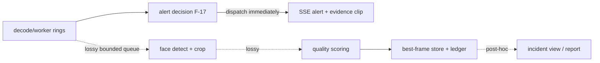

# WT-08 Research — Faces, Tracking, Imaging (detection, association, clear capture, enhancement)

- **Status**: scoped research catalog for the AI Sentinel improvement campaign. NON-AUTHORITATIVE (see frontmatter). Not a status or design document; `docs/CURRENT.md` / `docs/DESIGN.md` remain the only authorities.
- **Author**: campaign agent `FacesImagingResearch` (WT-08), worktree `jobs/sentinel-campaign/wt-08`, branch `codex/sentinel-08-faces-research`, baseline pinned at `e86d34b5d16abcc133ad3470c8d135d00b2423d4`.
- **Date of research**: 2026-09-29. All web sources verified on this date by direct fetch/search (method recorded per source in §11).
- **Evidence-level legend** used in every table:
  - **A** = primary source (paper/model card/official repo/standard) verified by direct fetch this session (text/JSON/LICENSE actually read).
  - **B** = primary source identified via search result metadata (title/URL/venue visible in result), full text not fetched.
  - **C** = secondary knowledge, convention, or engineering inference — must be re-verified before being quoted externally.
  - **M** = measured locally this session (machine + command recorded). Local measurement is on ONE machine with synthetic input; it is not an accuracy measurement.

---

## 0. Hard scope boundaries (binding for WT-21 / WT-22 / WT-23 / WT-27)

This workstream builds exactly three things:

1. **Face DETECTION** — where a face is in a frame, and how capture-worthy it is (size, sharpness, pose, occlusion, exposure).
2. **Face-to-track / face-to-incident ASSOCIATION WITH UNCERTAINTY** — linking a face crop to a person track and to the triggering incident window, always carrying an explicit confidence/ambiguity signal.
3. **CLEAR CAPTURE** — selecting the best pre-event and post-event frames/crops for human review.

We explicitly **do NOT** build, and the product must never appear to build:

- **Identity recognition** of any kind. No face embeddings are enrolled, compared, matched, or named. The existing `backend/face_intel.py` (F-30, disconnected) is an identity-registry/recognition engine ("known faces registry", embeddings, recognition audit); wiring it up is **out of scope** for these workstreams and would contradict this research. Any recognition-shaped field in `docs/blueprint/ui-contract.md` (`FaceObservation`, `FaceUnknownDetail`, `recognizedCount`, `recognized[]`) is a **contract hazard** — see §9 (WT-27 handoff).
- **Perpetrator labeling from proximity.** A face/body near a detected weapon or fight is a *witness-or-party ambiguity*, not an attribution. Co-occurrence in time/space is never reported as guilt, participation, or identity.
- **Claims that enhanced pixels are observed facts.** Every enhanced image is a **labeled derivative** of a preserved original. Generative detail (super-resolution, deblur, low-light synthesis) is invented texture that plausibly *could* exist; it is never evidence that it *does* (§5.2).

Nothing below may be used to relax these boundaries. Accuracy, tracking, and enhancement are capture-quality and review-aids features only.

---

## 1. Baseline facts this research relies on (campaign seeds)

Read from `wt-01/docs/blueprint/{runtime-map,ownership-map,runtime-map-verification}.md` and `wt-02/docs/blueprint/{design-map,ui-contract}.md` (committed artifacts of sibling agents). The reconciled seed (`wt-03/docs/blueprint/`) **did not exist when this document was finalized** — checked 2026-09-29.

| Fact | Source | Relevance here |
|---|---|---|
| `F-30` `backend/face_intel.py` (926 lines) is **disconnected**: no route, no caller, zero references outside its own tests; `bench/runtime.py:316` force-disables it. Its tracked test drives `/face/*` routes that exist nowhere in git. | runtime-map F-30, V-22 | Face feature starts from zero wiring; recognition-shaped code already exists and must NOT be silently connected. |
| `F-10` `backend/person_detector.py` (S-04): ONNX person path measured; **ByteTrack path unmeasured**; tracker state is local (`_active_tracks`, `_track_frame_count`, `_counted_ids`). | runtime-map F-10, §3.1 | Tracking integration lands here; `person_count` semantics are wrong today. |
| `person_count` is **derived as `len(tracks)`, not a tracker total** (SC-2 field). | runtime-map §2 (SC-2), F-10 | Visible-vs-unique counting definitions (§3.4) are a contract change. |
| `F-17` `broadcast_person_data` **has no caller** — person counts are never broadcast, despite the SSE event shape existing. | runtime-map F-17 | Counting/alerts wiring gap for WT-22. |
| `F-40` No calibration artifact (`backend/model_calibration.json` absent) → all scores unverified; worker marks calibration `DEGRADED`. | runtime-map F-40 | No confidence number from this system may be presented as calibrated probability. |
| Evidence layout `EVIDENCE_DIR/{alert_id}.mp4` + `evidence_ledger.jsonl` (SC-8); timestamps `captured_at`/`sample_timestamp`/`isoTime` (SC-6). | ownership-map SC-6/SC-8 | Face crops/derivatives must join this ledger, not a side channel (§6). |
| UI contract already declares `faceSummary`, `FaceObservation`, `FaceUnknownDetail`, `recognizedCount`/`recognized[]` as reserved-but-unparsed wire fields. | ui-contract.md L34–89, L333 | Identity-recognition vocabulary exists in the frontend contract; WT-27 must remove/neutralize it (§9). |
| Runtime evidence in `bench/results/**` is revision-mismatched (`6fb3bcac…`); `go2rtc_bridge`/`openrouter_reporting` untracked (B-1); docs:check red at baseline (B-6). | runtime-map B-1/B-5/B-6 | Any runtime claim in this doc is independent of those artifacts (measured on the pinned worktree). |

**Environment fact observed this session (M)**: `onnxruntime` 1.18.0 in the shared project venv lists `['TensorrtExecutionProvider','CUDAExecutionProvider','CPUExecutionProvider']` but **CUDAExecutionProvider fails to load** (`LoadLibrary` error 126 on `onnxruntime_providers_cuda.dll`, "CUDA_PATH is set but CUDA wasnt able to be loaded"). ONNX GPU inference is therefore **not usable in this environment as-is** (missing CUDA/cuDNN DLLs on PATH). This is consistent with registered evidence showing the weapon model on `CPUExecutionProvider`. Runtime budgets below assume **CPU inference on shared resources** until WT-21/22/23 prove otherwise; GPU numbers are literature values, clearly marked.

---

## 2. Face detection (feeds WT-21)

### 2.1 What "detectable" means for CCTV (small / blurry / low-light / occluded)

- Detection and *usable capture* are different bars. A face can be detected at very small scales while being useless for human review. The operative pixel scale for review-grade crops is **inter-eye distance (IED)** and face-box size in pixels — NIST's face-quality evaluation is literally organized around such defect axes: pose (yaw/pitch/roll), eyes open, IED, resolution, mouth open, background uniformity, under/over-exposure, eyeglasses, sunglasses, compression artifacts, **face occlusion**, **motion blur**, distance from eyes to image edges (A: NIST IR 8485, §11).
- Practical consequence: run detection at full decoded resolution (or the largest budget allows), set a **min-face-size gate for reporting** (not for detection), and always store the *native-resolution crop* plus the *frame*, never only a resized crop.
- Small-face regime is a known hard problem (TinyFaces, CVPR 2017 — B); surveillance-distance faces are a distinct benchmark regime (SCface, IET Biometrics — B; IARPA Janus Benchmark-S for surveillance video — B). Published detector AP on WIDER FACE "hard" split (B: WIDER FACE, CVPRW 2016) is the standard small/blurry face reference; CCTV degradation is usually *worse* than WIDER-hard because of codec artifacts (H.264 macroblocking) + low light + motion blur simultaneously.
- Occlusion: do not try to "detect through" heavy occlusion and report a face. Prefer (a) detector-agnostic occlusion/quality scoring (§4) and (b) honest "partially visible" states. Masked/occluded-face sets (e.g. MAFA — B) exist but are not needed for v1; a defect-axis score is sufficient.

### 2.2 Detector options (detection only — no embeddings, no identification)

| Option | Paper / provenance | ONNX | License (verified 2026-09-29) | Evidence | Key properties for CCTV | Notes |
|---|---|---|---|---|---|---|
| **YuNet** (OpenCV Zoo `face_detection_yunet_2023mar`) | OpenCV Zoo model dir (A: README "All files in this directory are licensed under MIT"); cv2.FaceDetectorYN ships in OpenCV (Apache-2.0) | yes, fixed input `1×3×640×640`, 232,589 B | **MIT** (A: LICENSE file fetched) | A (model + license); M (latency) | anchor-free tiny detector, 5-point landmarks out of the box (useful for pose/IED scoring without a recognition model) | **Recommended default.** Landmarks give IED/pose inputs for §4 for free. |
| **SCRFD** (insightface) | "Sample and Computation Redistribution for Efficient Face Detection", arXiv:2105.04714 (A), accepted ICLR-2022 per insightface changelog (A) | yes (`det_500m/det_2.5g/det_10g…` via model zoo) | **Code MIT; pretrained weights "non-commercial research purposes only"** (A: insightface README license section, including the 2025-11-24 update requiring licensing contact for open-sourced model packages) | A (paper + README) | best accuracy/latency trade-off family; multiple sizes | **License caveat confirmed**: weights cannot ship in a commercial product without a license from InsightFace. Weights also hard to fetch (model zoo hosted off-GitHub; GitHub release assets absent — M). Use only if campaign explicitly accepts non-commercial weights, else YuNet. |
| **RetinaFace** (deepinsight) | "RetinaFace: Single-stage Dense Face Localisation in the Wild", arXiv:1905.00641 (A), CVPR 2020 (A: insightface README) | repackaged ONNX widely available | code MIT; same non-commercial weight caveat as SCRFD (A: README "models trained with these data" clause) | A (paper) | strong accuracy, heavier than SCRFD at equal accuracy | reference implementation, not a first choice for edge CPU. |
| **BlazeFace** (Google MediaPipe) | "BlazeFace: Sub-millisecond Neural Face Detection on Mobile GPUs", arXiv:1907.05047 (A), CVPRW 2019 (A) | via MediaPipe/TFLite; third-party ONNX conversions exist (unverified) | **Apache-2.0** (A: mediapipe LICENSE fetched) | A (paper + license) | sub-millisecond class on mobile GPU; weaker on tiny/posed faces | acceptable ultra-light fallback; detection quality on CCTV-grade blur is its weakness. |
| **YOLO-face family** (yolov5-face / yolov8-face) | deepcam-cn/yolov5-face (GPL-3.0, A via GitHub API), derronqi/yolov8-face (GPL-3.0, A: LICENSE file fetched "GNU GENERAL PUBLIC License Version 3") | yes | **GPL-3.0** (A) | A (license) | accurate, familiar YOLO pipeline, heavier | GPL-3.0 is copyleft — **integration into this product's distribution needs legal review**; excluded from recommendation on license grounds unless the campaign accepts GPL obligations. |

**License summary (verified)**: MIT (YuNet model dir) → Apache-2.0 (BlazeFace/MediaPipe) → BSD/Apache (enhancement, §5) is the clean licensing path. SCRFD/RetinaFace weights = non-commercial (A). YOLO-face = GPL-3.0 (A).

### 2.3 Runtime cost (12 GB shared GPU / shared CPU)

- **M (this session, worktree `wt-08`, 2026-09-29)**: YuNet 2023mar ONNX (`sha256 8f2383e4dd3cfbb4553ea8718107fc0423210dc964f9f4280604804ed2552fa4`, 232,589 bytes, from `huggingface.co/opencv/face_detection_yunet`) on `onnxruntime` 1.18.0, `CPUExecutionProvider`, 4 intra-op threads, synthetic float input `1×3×640×640`, 5 warmup + 50 timed runs: **median 7.56 ms, p95 9.22 ms, mean 7.51 ms** per forward pass. This excludes decode/resize/NMS/postprocess and any face-crop I/O — budget **~15–25 ms/frame end-to-end** for a full face-detect+crop stage on this CPU (C, derived from M with a postprocess allowance).
- CUDA EP unusable in this environment (§1). SCRFD-2.5G class detectors are typically a few ms on a modern GPU and ~20–60 ms on CPU (C: literature/README-level numbers, **not measured here** — treat as order-of-magnitude only). Do not put unmeasured GPU numbers in reports.
- Face detection is cheap relative to the video violence/weapon paths already in the pipeline; run it **off the alert path** on a sampled frame rate (e.g. every Nth frame + all frames in an incident window), never synchronously in the trigger path (§4.4).

---

## 3. Person detection & tracking (feeds WT-22)

### 3.1 Tracker options

| Option | Primary source | Benchmarks / protocol in source | License | Evidence | Failure-mode profile | Notes |
|---|---|---|---|---|---|---|
| **ByteTrack** | "ByteTrack: Multi-Object Tracking by Associating Every Detection Box", arXiv:2110.06864 (A); ECCV 2022 (B) | MOT17/MOT20, KITTI, BDD100K, DanceTrack; MOTS-style HOTA/MOTA/IDF1 (A: abstract/venue) | **MIT** (A: LICENSE fetched "Copyright (c) 2021 Yifu Zhang"; GitHub API MIT) | A | low-score boxes re-association helps occlusion; id-switches under long occlusion still occur | **Recommended default** for single-camera association; already hinted at in repo (F-10 "ByteTrack path unmeasured"). |
| **BoT-SORT** | "BoT-SORT: Robust Associations Multi-Pedestrian Tracking", arXiv:2206.14651 (A) — note: the often-cited `2211.02676` is a **different paper** (corrected this session) | MOT17/MOT20 (MOTChallenge protocol) (A: title/venue) | **MIT** (A: NirAharon/BoT-SORT LICENSE fetched + GitHub API) | A | adds camera-motion compensation + appearance (ReID) cues; ReID is **identity-adjacent** (see caveat) | Good accuracy, but its ReID embedding branch must NOT be reused for face identity — keep it track-internal only, or disable appearance features. |
| **OC-SORT** | "Observation-Centric SORT: Rethinking SORT for Robust Multi-Object Tracking", arXiv:2203.14360 (A), CVPR 2023 (A: arXiv comment) | MOT17, KITTI, DanceTrack, CrowdHuman (A: title/venue) | **MIT** (A: GitHub API; LICENSE file fetched — note its copyright line reads "Yifu Zhang", apparently copied from ByteTrack; legal hygiene: replace with correct attribution before use) | A | observation-centric re-update handles non-linear motion / occlusion better than SORT-family KF-only | Strong candidate if id-switches dominate evaluation. |
| **DeepSORT** | "Simple Online and Realtime Tracking with a Deep Association Metric", arXiv:1703.07402 (A), ICIP 2017 (B) | MOT16/17 (A: title/venue) | **GPL-3.0** in `nwojke/deep_sort` (A: GitHub API "GNU General Public License v3.0"; LICENSE file fetched, GPL-3 text) | A | appearance ReID helps re-entry but inherits the same identity-adjacency caveat + GPL | Excluded on license grounds (GPL) unless campaign accepts; also oldest baseline. |

SORT (arXiv:1602.00763, ICIP 2016 — A) is the KF-only baseline all of the above improve on. Evaluation metric should be **HOTA** (arXiv:2009.07736, accepted IJCV — A), not MOTA alone, because we care about association quality (identity switches) as much as detection overlap; IDF1 additionally directly reflects id-switch cost.

### 3.2 Face-to-track association heuristics (with uncertainty)

There is no widely adopted "face-body association" benchmark protocol to copy (C: engineering judgment); treat association as an **explicitly heuristic, confidence-bearing** stage:

1. **Spatial containment**: face box center inside person box; face width/height within plausible ratio of head/upper-body box (e.g. face height ≤ 0.6 × person box height). IoU alone is wrong (faces are small part of body boxes).
2. **Vertical position**: face box in the *upper region* of the person box (accounting for crouching/bending: allow wide tolerance, degrade confidence instead of rejecting).
3. **Temporal co-occurrence**: a face detection is associated with track `t` only if `t` is active in the same frame and the face moved consistently with `t` over ≥2 frames (reduces flicker association).
4. **Ambiguity handling**: if ≥2 tracks satisfy the heuristic (crowds, overlapping boxes), emit the association as `ambiguous` with the candidate track IDs — NEVER pick one silently.
5. **Confidence output**: per association, emit `{face_crop_ref, track_id, confidence ∈ [0,1] heuristic, ambiguous: bool, reasons}`. The confidence is a heuristic score, **not a probability** (F-40: nothing here is calibrated).
6. **Occlusion/re-entry**: when a track is lost and re-acquired, the re-acquired track gets a NEW id; face crops from the old and new tracks are never merged into one "person". If the tracker offers no reliable cross-occlusion continuity, the association says "same person not established".

### 3.3 Multi-camera non-association rule (policy)

**Tracks and faces are namespaced per camera.** The system MUST NOT link a person (or face) across cameras — no cross-camera tracking, no cross-camera identity, no "the same individual appeared on camera 2". Reasons, in order: (a) it is identity recognition in disguise; (b) time-sync across sources is unverified (SC-6 semantics exist per-source only); (c) false cross-camera links directly create perpetrator-style attribution. UI and reports may show *coincident time windows* across cameras as separate, unlinked observations.

### 3.4 Visible vs unique counting (definitions — a contract change to SC-2/`person_count`)

- **Visible count** (`visible_person_count`): number of person detections passing the detector threshold in the current frame. It fluctuates with occlusion/blur; it is a per-frame observation.
- **Tracked count** (`active_track_count`): number of active tracker IDs in the current frame — the current `person_count = len(tracks)` (F-10) conflates this with a population estimate. Keep as-is but **rename in reports** to "tracked individuals in frame".
- **Unique-count estimate** (`unique_person_estimate_window`): distinct track IDs over a window **minus estimated id-switch/re-entry inflation** — an ESTIMATE with an explicit uncertainty band, never a fact. Long-occlusion re-entries and id-switches make it an overcount in crowds; detector misses make it an undercount. Report `±` band or "≥/≤" language only.
- **Never**: a unique-person count across cameras; a count of "perpetrators"; anything implied to be a census of people present.

### 3.5 Failure modes that must be visible in the product (not silently absorbed)

| Failure | Cause | Required surface |
|---|---|---|
| Id-switch | occlusion, crossing paths, similar clothing | per-track discontinuity counter in telemetry; "identity continuity unknown" in incident view |
| Re-entry overcount | track lost then re-acquired with new id | unique-count band widens with track churn |
| Merge/split | overlapping persons, detector flicker | association becomes `ambiguous`; no face crop attached to both |
| Detection dropout | blur/low light | visible count drops to 0 while people remain — never interpolate counts |
| Drift | long low-quality tracks | max track age w/ no high-quality face crop → track marked "no usable capture" |

---

## 4. Best-frame selection (feeds WT-22)

### 4.1 Scoring axes (all computable without any identity model)

Default stack = deterministic, auditable image statistics + detector landmarks (YuNet 5-point landmarks give pose/IED proxies without embeddings):

| Axis | Method | Source level | Notes |
|---|---|---|---|
| Sharpness / motion blur | variance of Laplacian (Pech-Pacheco et al., ICPR 2000 — B) and/or variance-of-gradients (Tenengrad); optional no-reference blur metric (Crete-style perceptual blur width — B) | B | compute on the **face crop**, not the full frame; report both frame-level and crop-level |
| Exposure | fraction of clipped pixels (saturated/black) + luminance histogram coverage; aligns with NIST IR 8485 under/over-exposure defect axes (A) | A/B | two-sided penalty |
| Pose (yaw) | landmark eye-corner geometry (yaw proxy) or a small pose regressor (6DRepNet/HopeNet — C, not verified this session) | A (axes) / C (models) | prefer landmark-based yaw proxy first; a pose model adds another artifact to license/verify |
| Face size | face-box pixels + **IED in pixels** (NIST IR 8485 IED axis — A) | A | primary review-usability gate |
| Occlusion | landmark visibility / box truncation at frame edges + simple texture heuristic; NIST IR 8485 "Face Occlusion", "Distance from Eyes to Edges" axes (A) | A | "partially visible" state is honest and useful |
| Learned quality (optional v2) | SER-FIQ (arXiv:2003.09373, CVPR 2020 — A), FaceQnet (arXiv:1904.01740, ICB 2019 — A), SDD-FIQA (arXiv:2103.05977 — A), MagFace (arXiv:2103.06627, CVPR 2021 Oral — A) | A | **caveat**: SER-FIQ/MagFace quality is derived from recognition embeddings. If used, the embedding MUST be computed transiently for quality scoring only — never stored, never compared to any registry. FaceQnet-style dedicated quality regressors are cleaner. ISO/IEC 29794-5 face-image-quality standard is referenced by NIST as finalizing (A: NIST IR 8485 exec summary) |

Selection rule: weighted score (weights in one TOML block, following the campaign's single-threshold-authority pattern of SC-5), deterministic tie-breaks (earlier frame wins pre-event; later wins post-event), and **every selected frame records its score vector + frame timestamp (SC-6) + source clip id (SC-8)**.

### 4.2 Pre-event buffers (the clearest frame often precedes the trigger)

- Violence/weapon triggers are late: the sharpest, most identifiable face is usually **before** the incident escalates (people move toward cover/turn away at trigger time). Selection MUST sweep a **pre-event window** (e.g. T−10 s … T0) and a post-event window (T0 … T+5 s), not just the trigger frame.
- The pipeline already keeps temporal frame rings (S-01: `backend/temporal_frames.py`, queue sizes 3/30/360/600). Face capture should read from the same rings via a bounded, lossy subscription — the **ring is the source of truth for "what frames existed"**, and capture must tolerate frames being long gone (record "window unavailable" honestly).

### 4.3 Async bounded pipeline that never delays the first alert



Rules: (1) the alert path (B) contains **zero** face/enhancement work; (2) capture work (D–F) runs in a bounded queue with drop-oldest semantics under load — dropped work is counted in telemetry, never retried silently into latency; (3) best-frame selection can complete seconds after the alert and the incident view must render "capture pending" rather than block; (4) enhancement (§5) is strictly offline/on-demand, never in any live path.

### 4.4 Verification experiment (WT-22)

Fixture-driven (no camera in this environment): synthetic degradation sweep over any licensed face-bearing fixture imagery — downscale (IED 4→60 px), Gaussian + motion blur, exposure shift, H.264 re-encode at low bitrate, partial occlusion overlays. Acceptance: (a) detection recall reported as a function of IED px per §2 gates; (b) best-frame selector beats random-frame and trigger-frame baselines on a human side-by-side rating (n≥2 raters, ≥50 incidents); (c) end-to-end alert latency budget shows **<1% change** with face capture enabled (proves the async boundary); (d) id-switch/occlusion stress sequence produces `ambiguous`/churn flags, not silent merging.

---

## 5. Image enhancement (feeds WT-23) — with forensic honesty as a hard gate

### 5.1 Options

| Capability | Option | Primary source | License (verified) | Evidence | Runtime cost on this box | Honesty risk |
|---|---|---|---|---|---|---|
| Super-resolution | **Real-ESRGAN** | arXiv:2107.10833 (A), ICCVW 2021 (B) | **BSD-3-Clause** (A: LICENSE fetched + GitHub API) | A | ~100s of ms–seconds per crop on CPU (C est.); GPU EP unavailable here | **HIGH** — GAN-based, hallucinates texture |
| Super-resolution | **SwinIR** | arXiv:2108.10257 (A) | **Apache-2.0** (A: LICENSE fetched + GitHub API) | A | heavier transformer (C est.) | HIGH |
| Super-resolution | **BSRGAN** | "Designing a Practical Degradation Model…", arXiv:2103.14006 (A), ICCV 2021 (A: arXiv comment) — note `2106.07119` is a wrong id (corrected this session) | **Apache-2.0** (A: LICENSE fetched + GitHub API) | A | (C est.) | HIGH |
| Deblurring | **Restormer** | arXiv:2111.09881 (A), CVPR 2022 (A: arXiv comment) | **MIT** (A: GitHub API license field; repo LICENSE file 404 but API classifies MIT) | A | (C est.) | HIGH — deblur is generative at SOTA |
| Deblurring | **MPRNet** | "Multi-Stage Progressive Image Restoration", arXiv:2102.02808 (A), CVPR 2021 (A: arXiv comment) | **NOASSERTION/"Other"** (A: GitHub API; LICENSE file 404 — license terms NOT verified) | A | (C est.) | HIGH; plus license unknown → **not recommended** |
| Deblurring | **NAFNet** | "Simple Baselines for Image Restoration", arXiv:2204.04676 (A), ECCV 2022 (A: arXiv comment) | LICENSE file text = **MIT** (A: fetched "MIT License, Copyright (c) 2022 megvii-model"); GitHub classifier "Other" (A) | A | (C est.) | HIGH |
| Low-light | **Zero-DCE** (CVPR 2020, arXiv:2001.06826 — A) | repo `li-chongguang/Zero-DCE` | **UNKNOWN** — repo returns 404 via API and README/LICENSE 404 (M, this session) | A (paper) / M (license failure) | light CNN (C) | MEDIUM (curve-estimation, less generative than GAN-SR but still synthesized) |
| Low-light (deterministic) | **CLAHE / histogram + gamma** (OpenCV) | textbook ops | OpenCV **Apache-2.0** (A) | A | <1 ms/crop (C) | **LOW** — pointwise, invertible-ish, no invented texture |
| Denoising | NAFNet/Restormer (above) or classical (NLM/bilateral — OpenCV) | — | as above | — | — | learned denoisers invent plausible texture too; classical denoisers only average existing pixels |

### 5.2 Forensic honesty — the controlling constraints (verified primary sources)

These are not opinions; they are the operative standards and peer-reviewed results:

1. **Enhancement is accepted forensically only with preservation + documentation.** SWGIT Section 11, "Best Practices for Documenting Image Enhancement", v1.3 (2010-01-15) (A: PDF fetched and read this session): best practices are "predicated on the assumption that an original file/image that has been subjected to processing be preserved"; surveillance images are **Category 1** (demonstrate what the recording device witnessed) and become **Category 2** (subject to scientific analysis) the moment an expert analyzes them; for Category 2 "the use and sequence of any enhancement techniques … should be documented in every case", documentation must let "a comparably trained person … produce comparable results", and minimum requirements are "identifying the software application and/or techniques as well as the settings and parameters used". Its sample SOP **prohibits** Rubber Stamp, Airbrush, Paintbrush, Paint Bucket, Eraser, and Blur tools — i.e. even the accepted darkroom-analog practice forbids painting in detail. (Quote policy: cite as SWGIT Section 11 v1.3 (2010-01-15).)
2. **Deblur, noise reduction, restoration, frame averaging, advanced sharpening are "advanced" techniques** requiring full parameter documentation (same source, A). Super-resolution and generative enhancement have **no counterpart in that accepted list at all** — they are a step beyond, so their output is a *visualization aid*, not evidence of true detail.
3. **Modern SR/deblur provably trades distortion for perceptual realism.** Blau & Michaeli, "The Perception-Distortion Tradeoff", CVPR 2018, arXiv:1711.06077 (A: title/venue verified): as models produce more "perceptually plausible" outputs, distortion metrics (PSNR/SSIM) necessarily worsen — the plausible detail is *generated*, and cannot be assumed true.
4. **Face upsampling can invent a different face.** PULSE (CVPR 2020, arXiv:2003.03808 — A: title/venue verified) showed a low-resolution face maps to *many* plausible high-resolution faces (a public demonstration produced output faces of different apparent identity/ethnicity from the same tiny input). For faces specifically, an enhanced crop is therefore **never** evidence of what the person's face actually looked like.
5. **Legal/process frame**: ASTM E2825-21, "Standard Guide for Forensic Digital Image Processing" (B: ASTM page title + ANSI/NIST standards registry listing `nist.gov/standard/1491` in search results; ASTM blocks fetch, text not read); ISO/IEC 27037:2012, "Guidelines for identification, collection, acquisition and preservation of digital evidence" (B: iso.org standard page 44381 located); PCAST 2016, "Forensic Science in Criminal Courts: Ensuring the Scientific Validity of Feature-Comparison Methods" (B: obamawhitehouse.archives.gov + govinfo copies located); US admissibility of enhanced/analogous evidence runs through FRE 702 / Daubert factors — tested method, known error rates, standardized operation, documentation (C: legal framing; **not legal advice**, reviewers/courts decide per jurisdiction).
6. **NIST face-quality evidence** (A: NIST IR 8485, fetched): face image quality is measurable along concrete defect axes (pose, IED, blur, exposure, occlusion, compression artifacts…); quality assessment is an established evaluation activity (FATE Quality track), and ISO/IEC 29794-5 face image quality is referenced as the standardizing axis set. Quality tells you whether a crop is *usable* — it never licenses *inventing* what is not in it.

### 5.3 Derivative discipline (required in the implementation, WT-23 + WT-27)

- Every enhanced output is written as `EVIDENCE_DIR/{alert_id}.face{N}.frame{TS}.enhanced.png` **plus a transformation record**: model name+version, weights hash, parameters, software version, operator id, timestamp (SC-6), input original hash, output hash (SC-8 ledger appends, never rewrites). Originals are immutable (SWGIT preservation assumption; ISO/IEC 27037 handling).
- On-image and in-report labeling is mandatory: `ENHANCED DERIVATIVE — synthesized detail may be present; not an observation` (exact wording up to WT-27, semantics fixed here). UI must show original beside derivative, derivative visually distinct.
- Distortion measurement harness (before any enhancement ships): PSNR/SSIM **and** LPIPS-style perceptual distance (C: standard practice) between derivative and original; **identity-similarity bound** using a transient face embedding (cosine between enhanced and original crop) — if enhancement changes identity-similarity materially (threshold to be calibrated), the pipeline flags "identity-altering enhancement" and the output is disallowed for capture use (embedding used transiently for this check only — §4.1 caveat applies). Hallucination-oriented benchmarks (e.g. PIPAL for GAN-distortion — C, not verified this session) are optional v2.

---

## 6. Evidence & ethics (feeds WT-27, with S-07/S-14/S-19 slices)

- **Face crops are biometric personal data.** Retention bounded by the alert/evidence lifecycle; no face-crop collection outside incident windows; no face galleries; no export to external services (campaign constraint also forbids uploads). Access to face crops goes through the existing auth (F-33) and audit log (F-34) — every crop view/export is an audited event.
- **Chain of custody for derivatives**: originals hashed at capture into `evidence_ledger.jsonl` (SC-8); each derivative appends a record with parent hash + transformation (§5.3). `"N/A"` hash substitution (runtime-map R-4) is a known evidence-integrity gap — face evidence inherits it; WT-27/S-07 should close it before face evidence is presented anywhere official.
- **What reviewers/courts accept** (B/C, §5.2 items 1–5): preserved originals + documented, reproducible processing + honest labeling. What they will not accept and what we therefore never produce: unenhanceable "enhanced" claims of true appearance; unlabeled composites; identification claims from our system; proximity-based attribution.
- **Ethics specifics**: children and bystanders will appear in footage; crop minimization (smallest region needed), no "person gallery" browsing UX, no per-person longitudinal tracking beyond the incident window; every negative finding ("no usable face captured") is stated as such rather than left to be misread.

---

## 7. Recommendation tables

### WT-21 — Face detection & association

| # | Option | Evidence | Datasets/protocols in source | License | Runtime (this box) | Integration effort | Verification experiment | Verdict |
|---|---|---|---|---|---|---|---|---|
| 1 | **YuNet (OpenCV Zoo 2023mar)** + landmark-based pose/IED | A (license/model), M (latency 7.56 ms median CPU fwd) | OpenCV Zoo eval (B) | MIT | **measured**: ~15–25 ms/frame stage budget (C from M) | LOW: single ONNX, F-15 area (face module) stays unwired; new detector behind S-04-style loader; SC-2 additive fields | IED-sweep recall fixture (§4.4); latency re-measure in real worker | **DO FIRST** |
| 2 | YuNet + transient quality model (FaceQnet-style) | A (papers) | IJB/quality benchmarks (B) | FaceQnet repo license unverified (C) | + small CNN per crop | MED | side-by-side vs (1) on fixture sweep | v2 |
| 3 | SCRFD-2.5G | A (paper+README) | WIDER FACE (B) | **weights non-commercial (A)** | unmeasured (GPU EP broken) | MED | WIDER-hard recall vs (1); only if license cleared | conditional |
| 4 | YOLO-face (yolov5/8-face) | A (license) | WIDER/COCO-style (B) | **GPL-3.0** | unmeasured | MED | — | not recommended (license) |

### WT-22 — Tracking, counting, best frames

| # | Option | Evidence | Datasets/protocols | License | Runtime | Integration effort | Verification experiment | Verdict |
|---|---|---|---|---|---|---|---|---|
| 1 | **ByteTrack** (single-cam) + HOTA/IDF1 eval | A (paper+license) | MOT17/MOT20, DanceTrack protocol (A) | MIT | tracker overhead ≪ detection (C) | MED: F-10 `person_detector.py` (S-04), SC-2 `person_count` rename + additive fields | id-switch/occlusion stress (§4.4d); HOTA on fixture seqs | **DO FIRST** |
| 2 | OC-SORT | A (paper+license) | MOT17/KITTI/DanceTrack (A) | MIT (attribution line to fix) | (C) | MED | head-to-head vs (1) on same fixtures | strong alt |
| 3 | BoT-SORT w/o ReID (camera-motion comp) | A (paper+license) | MOTChallenge (A) | MIT | (C) | MED | same | alt if camera shake matters |
| 4 | DeepSORT / BoT-SORT-with-ReID | A | MOT16/17 (A) | GPL-3.0 / ReID identity-adjacent | (C) | MED–HIGH | — | not recommended (license / identity adjacency) |
| 5 | Best-frame scorer (Laplacian-var + exposure + yaw + IED + occlusion, weighted TOML) | A (NIST axes), B (blur metrics) | NIST IR 8485 axes (A) | n/a (own code) | <2 ms/crop (C) | MED: F-10/F-17 + SC-8 append-only | human A/B vs random & trigger-frame (§4.4b) | **DO FIRST** |
| 6 | Pre-event ring sweep + async bounded capture queue | baseline-informed (S-01 rings) | n/a | n/a | latency-neutral by construction | MED | (§4.4c) latency <1% delta | **DO FIRST** |

### WT-23 — Enhancement (strictly offline/on-demand)

| # | Option | Evidence | Datasets/protocols | License | Runtime | Integration effort | Verification experiment | Verdict |
|---|---|---|---|---|---|---|---|---|
| 0 | **Deterministic baseline first: crop + CLAHE/gamma + labeled derivative ledger** | A (SWGIT Section 11 framework) | n/a | Apache-2.0 | <1 ms/crop | LOW–MED (ledger part is the real work) | reproducibility: same input+params → byte-identical output | **DO FIRST (this is the evidence-safe tier)** |
| 1 | Real-ESRGAN (perceptual aid tier) | A | Real-ESRGAN training/eval protocol (A) | BSD-3 | (C est., CPU-only here) | MED: offline tool page (U-scope TBD) | distortion harness + identity-similarity bound (§5.3) | conditional on harness + labels |
| 2 | NAFNet (deblur/denoise, perceptual aid tier) | A | GoPro/SIDD-style (B) | MIT text (A) | (C est.) | MED | same | alt to Restormer (license verifiable) |
| 3 | Restormer | A | (B) | MIT (API) | (C est.) | MED | same | alt |
| 4 | Zero-DCE | A (paper) | — | **UNKNOWN (M: repo 404)** | (C) | — | — | blocked (license) |
| 5 | MPRNet | A | (B) | **unverified (LICENSE 404)** | (C) | — | — | blocked (license) |

---

## 8. What we will NOT claim (binding wording rules for reports/UI copy — WT-27)

1. We do **not** identify people. No name, identity, or "recognized person" language, anywhere. (Existing `recognizedCount`/`recognized[]` contract fields are misleading vocabulary — §9.)
2. We do **not** label anyone a perpetrator, suspect, or participant based on proximity, co-occurrence, or being near a weapon/fight.
3. We do **not** claim enhanced/super-resolved detail is what actually existed. Enhanced images are labeled derivatives; synthesized texture/detail is possible-but-unobserved.
4. We do **not** claim calibrated confidence. Our scores are heuristic (F-40: no calibration artifact exists).
5. We do **not** claim unique person counts across cameras, nor exact unique person counts in crowds (bands/≥-style language only, §3.4).
6. We do **not** claim cross-camera continuity of any individual (§3.3).
7. We do **not** claim face quality scores are identity or truthfulness signals — usability of capture only.
8. We do **not** claim completeness: "no face captured" is a possible true state and is reported as such; "no person counted" ≠ "no person present".
9. We do **not** present any face crop as evidence-grade without the transformation record + preserved original (§5.3/§6).
10. We do **not** make legal claims about admissibility in any jurisdiction; we follow documented-practice standards (SWGIT/ASTM/ISO references) and leave admissibility to courts.

---

## 9. Engineer handoff

### WT-21 (detection/association)
- Detector: **YuNet 2023mar ONNX**, MIT, weights pin `sha256 8f2383e4dd3cfbb4553ea8718107fc0423210dc964f9f4280604804ed2552fa4` (232,589 B; fetch URL recorded in §11). Fixed input `1×3×640×640`; outputs 12 tensors (`cls/obj/bbox/kps` at strides 8/16/32). Latency measured: 7.56 ms median CPU forward (details §2.3).
- Do NOT wire `backend/face_intel.py` (F-30). If face routes are ever added (SC-1 change, orchestrator-owned), they must be detection/capture/policy only.
- Association contract (§3.2) is additive to SC-2: `face_assoc: [{crop_ref, track_id, confidence, ambiguous, reasons}]` — heuristic score, explicitly uncalibrated.
- SCRFD usable only if InsightFace non-commercial weight terms are accepted or licensed; YOLO-face excluded (GPL-3.0).
- Env blocker to fix before GPU claims: onnxruntime CUDA EP DLL load failure (§1) — coordinate with runtime/inference slices; all current planning assumes CPU.

### WT-22 (tracking/counting/best frames)
- **ByteTrack (MIT)** first, HOTA+IDF1 evaluation, OC-SORT as A/B alternative; DeepSORT/ReID-bearing configs out (GPL / identity adjacency).
- SC-2 rename: `person_count` → keep wire field but document as `active_track_count`; add `visible_person_count` and `unique_person_estimate_window` (with band). F-17 `broadcast_person_data` needs a caller for counts to reach the UI at all.
- Best-frame scorer config lives in one TOML block (SC-5 pattern); selection records score vector + SC-6 timestamps + SC-8 parent refs; pre-event window sweep mandatory (§4.2); async bounded capture must not touch the alert path (§4.3).
- Multi-camera non-association rule is a product-wide invariant (§3.3) — enforce in types (`lib/detection-types.ts`, S-04/S-13 consumers), not just docs.

### WT-23 (enhancement)
- Ship the deterministic tier (§7 WT-23 #0) with the derivative ledger BEFORE any generative model. Ledger record fields per §5.3 (parent hash, model+weights hash, params, versions, operator, timestamps).
- Generative tier (Real-ESRGAN BSD-3 / NAFNet-MIT / Restormer-MIT) is a human-review perceptual aid only, gated on: distortion harness (PSNR/SSIM/LPIPS + transient identity-similarity bound, §5.3), mandatory `ENHANCED DERIVATIVE` labeling, original-first UI.
- Blocked options: Zero-DCE (license unknown), MPRNet (license unverified).
- Never run enhancement in live paths; GPU EP currently unusable here — budget CPU-only until resolved.

### WT-27 (assumed = reporting / evidence / UI-copy workstream; confirm with orchestrator)
- Apply §8 wording rules verbatim in report templates and UI strings.
- Contract hazard: `ui-contract.md` `FaceSummaryPayload`/`FaceObservation`/`FaceUnknownDetail` + `recognizedCount`/`recognized[]` imply recognition; change vocabulary to detection/capture semantics (`detectedFaces`, `captureQuality`, `unknown`→`unlabeled` or drop entirely). Reserved-field note in ui-contract L333 must be updated in the same change.
- Face crops/derivatives join `evidence_ledger.jsonl` (SC-8) with the §5.3 record; audit-log (F-34) every face-crop access; close the `"N/A"` hash substitution gap (R-4) before any face evidence is exported.
- Reporting (S-14 facts-only discipline) must never let report generation (incl. any remote/LLM text path) assert face/image analysis results beyond the recorded ledger facts.

---

## 10. Gaps, limitations, and honest caveats

1. **No camera device** in this environment → all proposed experiments are fixture/synthetic; live-camera behavior (exposure control, PTZ motion, real codec streams) is unmeasured.
2. **No face-annotated footage** exists in the campaign inputs and none may be uploaded externally → accuracy numbers for detectors/trackers on OUR footage are unknown; benchmark references (WIDER/MOT/etc.) are proxy evidence only.
3. **GPU inference unmeasured**: onnxruntime CUDA EP fails to load here (§1); tracker/SR timings beyond the YuNet CPU measurement are literature-level (C).
4. **Legal analysis is referenced, not performed**: ASTM E2825-21 and ISO/IEC 27037 full texts were not read (paywalled/403); PCAST/SWGIT-level framing is solid but jurisdiction-specific admissibility needs qualified review. Not legal advice.
5. **Some licenses unverified**: MPRNet (LICENSE 404), Zero-DCE (repo 404), FaceQnet repo license — treated as blocked/unknown, not assumed permissive.
6. **`wt-03/docs/blueprint/` (reconciled seed) was absent** at finalization time (checked 2026-09-29); recommendations were aligned to wt-01/wt-02 seeds only. If the reconciled seed changes F/U/SC IDs, §9 must be re-checked.
7. **FaceQnet/SER-FIQ/quality-model selection remains v2** — chosen-quality-model evaluation is deliberately deferred; the deterministic defect-axis stack (§4.1) is the v1 answer.
8. Association heuristics (§3.2) are engineering proposals, not benchmark-validated; their thresholds require the fixture experiment before being trusted.
9. Unique-count estimation (§3.4) has no accepted protocol; our definition is intentionally conservative and must stay ≥/-style.

---

## 11. Source appendix (all verified 2026-09-29; method noted)

| Source | ID/URL | Verified by | Level |
|---|---|---|---|
| InsightFace README (license policy: code MIT; data+trained models non-commercial; 2025-11-24 licensing update; SCRFD ICLR-2022 note; RetinaFace CVPR-2020) | github.com/deepinsight/insightface README | raw fetch | A |
| SCRFD paper | arXiv:2105.04714 "Sample and Computation Redistribution for Efficient Face Detection" | arXiv API | A |
| RetinaFace paper | arXiv:1905.00641 | arXiv API | A |
| BlazeFace paper | arXiv:1907.05047 (CVPRW 2019) | arXiv API | A |
| MediaPipe license | Apache-2.0 LICENSE | raw fetch | A |
| YuNet model dir + LICENSE | opencv_zoo/models/face_detection_yunet (MIT) | raw fetch of README + LICENSE | A |
| YuNet ONNX weights | huggingface.co/opencv/face_detection_yunet (232,589 B, sha256 8f2383e4…52fa4) | download + hash | A/M |
| ByteTrack | arXiv:2110.06864; repo LICENSE MIT | arXiv API + raw LICENSE + GitHub API | A |
| BoT-SORT | arXiv:2206.14651; NirAharon/BoT-SORT MIT | arXiv API + raw LICENSE + GitHub API | A |
| OC-SORT | arXiv:2203.14360 (CVPR 2023); repo MIT (copyright line needs fixing) | arXiv API + raw LICENSE + GitHub API | A |
| SORT / DeepSORT | arXiv:1602.00763 (ICIP 2016); arXiv:1703.07402 (ICIP 2017); nwojke/deep_sort GPL-3.0 | arXiv API + GitHub API + raw LICENSE | A |
| HOTA | arXiv:2009.07736 (IJCV) | arXiv API | A |
| Real-ESRGAN | arXiv:2107.10833; repo BSD-3-Clause | arXiv API + raw LICENSE + GitHub API | A |
| SwinIR | arXiv:2108.10257; repo Apache-2.0 | arXiv API + raw LICENSE + GitHub API | A |
| BSRGAN | arXiv:2103.14006 (ICCV 2021); repo Apache-2.0 | arXiv API + raw LICENSE + GitHub API | A |
| Restormer | arXiv:2111.09881 (CVPR 2022); GitHub license field MIT | arXiv API + GitHub API | A |
| MPRNet | arXiv:2102.02808 (CVPR 2021); repo license unclassified (LICENSE 404) | arXiv API + GitHub API | A (facts) |
| NAFNet | arXiv:2204.04676 (ECCV 2022); LICENSE text MIT | arXiv API + raw LICENSE + GitHub API | A |
| Zero-DCE | arXiv:2001.06826 (CVPR 2020); repo gone/404 → license unknown | arXiv API + GitHub API (404) | A (facts) |
| yolov5-face / yolov8-face | GitHub API + raw LICENSE: GPL-3.0 | fetch | A |
| SER-FIQ | arXiv:2003.09373 (CVPR 2020) | arXiv API | A |
| FaceQnet | arXiv:1904.01740 (ICB 2019) | arXiv API | A |
| SDD-FIQA | arXiv:2103.05977 | arXiv API | A |
| MagFace | arXiv:2103.06627 (CVPR 2021 Oral) | arXiv API | A |
| DanceTrack | arXiv:2111.14690 (CVPR 2022) | arXiv API | A |
| CrowdHuman | arXiv:1805.00123 | arXiv API | A |
| WIDER FACE | arXiv:1511.06523 (CVPRW 2016) | arXiv API | A |
| Finding Tiny Faces | arXiv:1612.04402 (CVPR 2017) | arXiv API | A |
| Perception-Distortion Tradeoff | arXiv:1711.06077 (CVPR 2018) | search metadata + arXiv link | A/B |
| PULSE | arXiv:2003.03808 (CVPR 2020) | search metadata + arXiv link | A/B |
| SWGIT Section 11 "Best Practices for Documenting Image Enhancement" v1.3 (2010-01-15) | swgde.org/wp-content/uploads/2024/06/Section_11_Best_Practices_for_Documenting_Image_Enhancement.pdf | PDF fetched, text read (quotes in §5.2) | A |
| NIST IR 8485 "FATE Part 11: Face Image Quality Vector Assessment" (Sept 2023, DOI 10.6028/NIST.IR.8485) | nvlpubs.nist.gov/NIST.IR.8485.pdf | PDF fetched, text read | A |
| NIST FATE Quality track page | pages.nist.gov/frvt/html/frvt_quality.html | fetch | A |
| ASTM E2825-21 "Standard Guide for Forensic Digital Image Processing" | astm.org/e2825-21.html; nist.gov/standard/1491 | search metadata (fetch 403) | B |
| ISO/IEC 27037:2012 | iso.org/standard/44381.html | search metadata (fetch found wrong std no. 43775 first — corrected) | B |
| PCAST 2016 "Forensic Science in Criminal Courts…" | obamawhitehouse.archives.gov + govinfo | search metadata | B |
| SCface / IJB-S / QMUL-SurvFace / MAFA | surveillance & occluded face sets | not fetched; known benchmarks | C (cited only as regimes) |
| Laplacian-variance sharpness (Pech-Pacheco et al., ICPR 2000); blur-width metric (Crete et al., 2007) | classic metrics | not fetched | B/C |

**Corrections made during verification (recorded to prevent propagation)**: the BoT-SORT paper is arXiv:**2206.14651** (not 2211.02676 — that ID is an unrelated statistics paper); BSRGAN is arXiv:**2103.14006** (not 2106.07119 — unrelated); DeepSORT is arXiv:**1703.07402** (not 1702.00086 — unrelated); SER-FIQ is arXiv:**2003.09373** (not 2004.00108 — unrelated); NIST face-quality report is **IR 8485** (IR 8525 is the age-estimation report).

### Appendix A — reproducibility: YuNet latency measurement

```text
Model:  face_detection_yunet_2023mar.onnx (huggingface.co/opencv/face_detection_yunet)
        sha256 8f2383e4dd3cfbb4553ea8718107fc0423210dc964f9f4280604804ed2552fa4, 232,589 bytes
Host:   Windows 11 x64, RTX 3060 12 GB (driver 591.86), 16 GB RAM, shared campaign box
Runtime: project venv onnxruntime 1.18.0, CPUExecutionProvider, intra_op_num_threads=4
Input:  synthetic float32 (1,3,640,640); 5 warmup + 50 timed runs; time.perf_counter
Result: median 7.56 ms | p95 9.22 ms | mean 7.51 ms  (forward pass only)
CUDA:   CUDAExecutionProvider listed but FAILS: LoadLibrary error 126 on
        onnxruntime_providers_cuda.dll ("CUDA_PATH is set but CUDA wasnt able to be loaded")
Script: assets/bench_yunet.py in wt-08 (untracked scratch; not part of deliverable)
```

Note on sourcing the model: `opencv_zoo` main branch serves a git-lfs pointer via raw GitHub (131 B) — use the Hugging Face mirror URL above. InsightFace model-zoo SCRFD weights were not fetchable via GitHub releases (v0.7 tag has no assets) and are non-commercial in any case.
